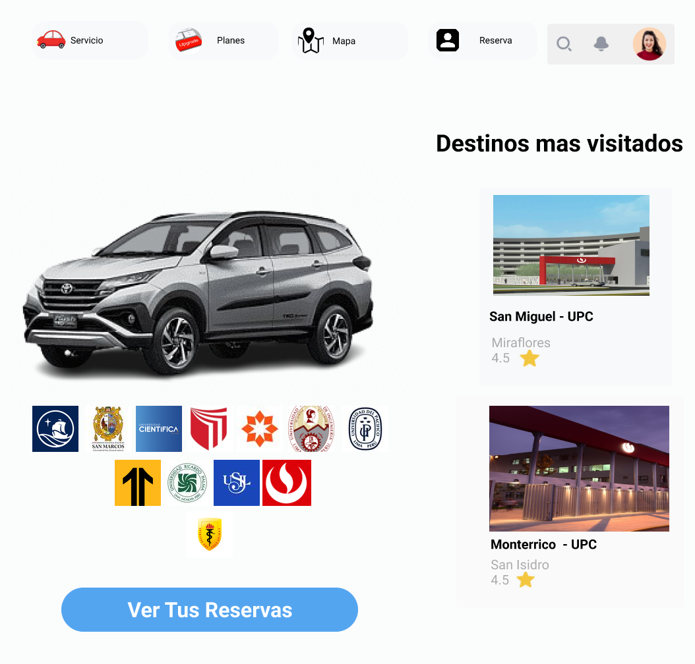
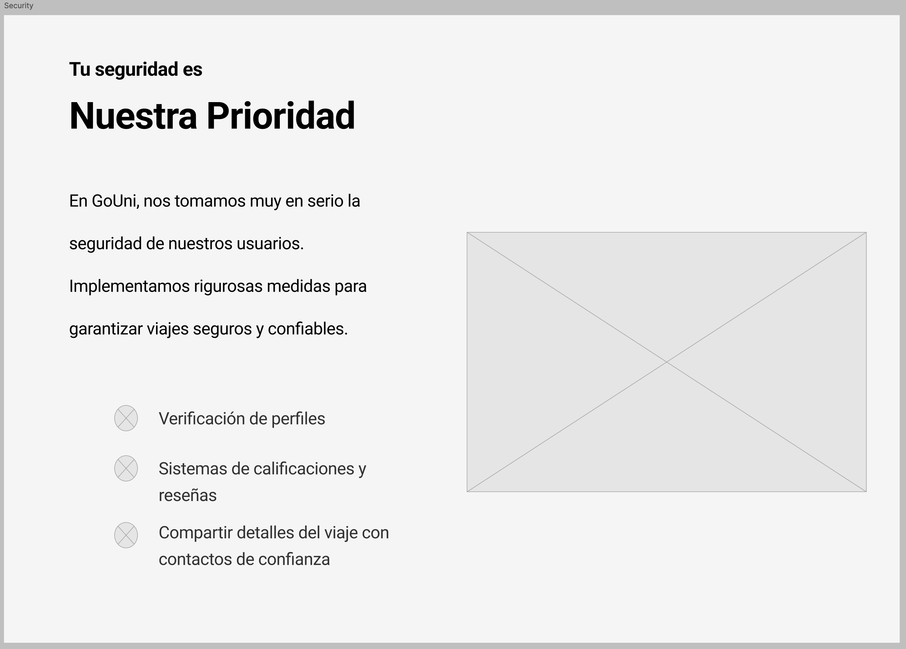
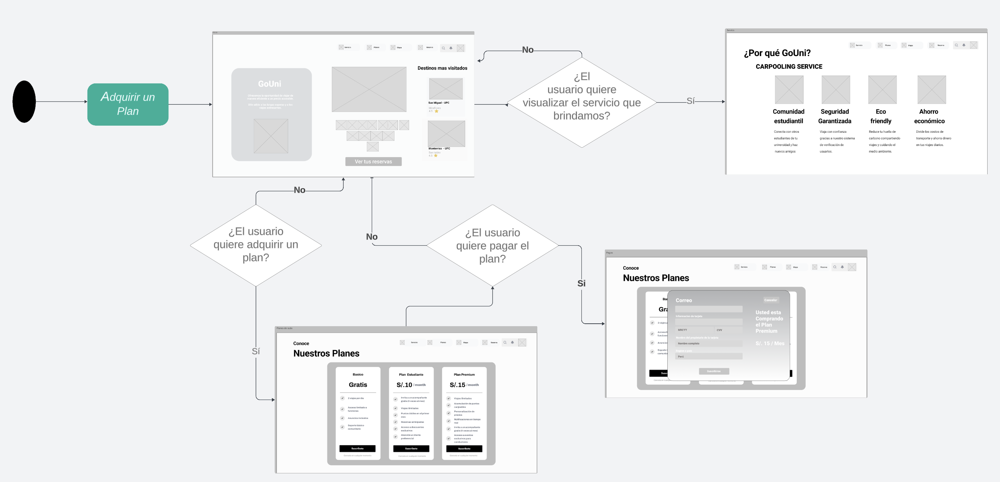

# COURSE PROJECT

---

<p align="center">
    <strong>Universidad Peruana de Ciencias Aplicadas</strong><br>
    </img><br>
    <strong>Ingeniería de Software</strong><br>
    <strong>Team Software Process</strong><br>
    <strong>Profesor: Elio Jefferrson Navarrete Vilca</strong><br>
    <br>Informe del TB1</br>
</p>

<p align="center">
    <strong>Startup: StudentConnect</strong><br>
    <strong>Producto: GoUni </strong>
</p>

### Team Members:

<div style="display: flex; justify-content: center; align-items: center;">

| **Member**                          | **Code**    |
|-------------------------------------|-------------|
| Anampa Lavado, Luis Angel           | u202218664  |
| Ayquipa Ubaldo, Abraham Israel      | u202218475  |
| Onofre Ruiz, Carlos Jesus      	  | u202115590  |

</div>

<p align="center">
    <strong>Septiembre 2025</strong>
</p>

---

# Registro de Versiones del Informe

 __TB1__

Para el desarrollo de la entrega **TB1**, se optó por dividir el trabajo de la siguiente forma:

| **Versión**  | **Fecha**  | **Autor**                         | **Descripción**                                                                                                   |
|--------------|------------|-----------------------------------|-------------------------------------------------------------------------------------------------------------------|
<<<<<<< HEAD
|**#01 - TB1**| 09/09/25   | Anampa Lavado, Luis Angel         | Competidores, Análisis competitivo, Estrategias frente a competidores, Product backlog, Style guidelines, Web style guidelines, Information architecture, Landing page UI design, Landing page mockup, Web applications mockup, Database diagram, Software deployment configuration, Development Evidence for Sprint Review, Execution Evidence for Sprint Review, Services Documentation Evidence for Sprint Review, Software Deployment Evidence for Sprint Review |
|**#01 - TB1**| 09/09/25   | Ayquipa Ubaldo, Abraham        | Startup Profile, Descripción de la startup, Antecedentes y problemática, Lean UX Problem Statements, Lean UX Assumptions, Segmentos objetivo, Organization Systems, Labeling Systems, SEO Tags and Meta Tags, Searching Systems, Navigation Systems, Landing Page Wireframe, Web Applications Wireframes, Class Diagrams, Class Dictionary |
|**#01 - TB1**| 10/09/25   | xxxxxxxx, xxxxxxxxx     | Registro de entrevistas, Software deployment configuration, Development Evidence for Sprint Review, Execution Evidence for Sprint Review, Services Documentation Evidence for Sprint Review, Software Deployment Evidence for Sprint Review |
|**#01 - TB1**| 08/09/25   | xxxxxxxx, xxxxxxx     | Lean UX Hypothesis Statements, Lean UX Canvas, Diseño de entrevistas, User Personas, Empathy Mapping, Impact Mapping, Domain-Driven Software Architecture, Software Development Environment Configuration, Source Code Management, Source Code Style Guide & Conventions |
|**#01 - TB1**| 10/09/25   | xxxxxxx,xxxxxxxxx   | User Task Matrix, Journey Map, As-Is Scenario Map, To-Be Scenario Map, Parte de user stories, Parte de diseño de entrevistas, Software Architecture Context Diagram, Software Architecture Container Diagrams, Software Architecture Components Diagrams |
=======
| **#01 - TB1**| 09/09/25   | Anampa Lavado, Luis Angel         | Competidores, Análisis competitivo, Estrategias frente a competidores, Product backlog, Style guidelines, Web style guidelines, Information architecture, Landing page UI design, Landing page mockup, Web applications mockup, Database diagram, Software deployment configuration, Development Evidence for Sprint Review, Execution Evidence for Sprint Review, Services Documentation Evidence for Sprint Review, Software Deployment Evidence for Sprint Review |
|              | 09/09/25   | Ayquipa Ubaldo, Abraham        | Startup Profile, Descripción de la startup, Antecedentes y problemática, Lean UX Problem Statements, Lean UX Assumptions, Segmentos objetivo, Organization Systems, Labeling Systems, SEO Tags and Meta Tags, Searching Systems, Navigation Systems, Landing Page Wireframe, Web Applications Wireframes, Class Diagrams, Class Dictionary |
|              | 10/09/25   | Onofre Ruiz, Carlos Jesus     | Registro de entrevistas, Software deployment configuration, Development Evidence for Sprint Review, Execution Evidence for Sprint Review, Services Documentation Evidence for Sprint Review, Software Deployment Evidence for Sprint Review |
|              | 08/09/25   | xxxxxxxx, xxxxxxx     | Lean UX Hypothesis Statements, Lean UX Canvas, Diseño de entrevistas, User Personas, Empathy Mapping, Impact Mapping, Domain-Driven Software Architecture, Software Development Environment Configuration, Source Code Management, Source Code Style Guide & Conventions |
|              | 10/09/25   | xxxxxxx,xxxxxxxxx   | User Task Matrix, Journey Map, As-Is Scenario Map, To-Be Scenario Map, Parte de user stories, Parte de diseño de entrevistas, Software Architecture Context Diagram, Software Architecture Container Diagrams, Software Architecture Components Diagrams |
>>>>>>> 5d61e851f0da19d4acf4e552d34f360b59dacaf6

# Contenido

## Tabla de contenidos
- [**Capítulo I: Introducción.**](#capítulo-i-introducción)
  - [**1.1 Startup Profile.**](#11-startup-profile)
    - [**1.1.1 Descripción del startup.**](#111-descripción-del-startup)
    - [**1.1.2 Perfiles de los integrantes del equipo.**](#112-perfiles-de-los-integrantes-del-equipo)
  - [**1.2. Solution Profile.**](#12-solution-profile)
    - [**1.2.1. Antecedentes y Problemática.**](#121-antecedentes-y-problemática)
    - [**1.2.2. Lean UX Process.**](#122-lean-ux-process)
      - [**1.2.2.1. Lean UX Problem Statements.**](#1221-lean-ux-problem-statements)
      - [**1.2.2.2. Lean UX Assumptions.**](#1222-lean-ux-assumptions)
      - [**1.2.2.3. Lean UX Hypothesis Statements.**](#1223-lean-ux-hypothesis-statements)
      - [**1.2.2.4. Lean UX Canvas.**](#1224-lean-ux-canvas)
  - [**1.3. Segmentos objetivo.**](#13-segmentos-objetivo)
- [Capítulo II: Requirements Elicitation \& Analysis](#capítulo-ii-requirements-elicitation--analysis)
  - [2.1. Competidores](#21-competidores)
    - [2.1.1. Análisis competitivo](#211-análisis-competitivo)
    - [2.1.2. Estrategias y tácticas frente a competidores](#212-estrategias-y-tácticas-frente-a-competidores)
  - [2.2. Entrevistas](#22-entrevistas)
    - [2.2.1. Diseño de entrevistas](#221-diseño-de-entrevistas)
    - [2.2.2 Registro de entrevistas](#222-registro-de-entrevistas)
    - [2.2.3 Análisis de entrevistas.](#223-análisis-de-entrevistas)
  - [2.3. Needfinding](#23-needfinding)
    - [2.3.1. User Personas](#231-user-personas)
    - [2.3.2. User Task Matrix](#232-user-task-matrix)
    - [2.3.3. User Journey Mapping](#233-user-journey-mapping)
    - [2.3.4. Empathy Mapping](#234-empathy-mapping)
    - [2.3.5. As-is Scenario Mapping](#235-as-is-scenario-mapping)
  - [2.4. Ubiquitous Language](#24-ubiquitous-language)
- [Capítulo III: Requirements Specification](#capítulo-iii-requirements-specification)
  - [3.1. To-Be Scenario Mapping](#31-to-be-scenario-mapping)
  - [3.2. User Stories](#32-user-stories)
  - [3.3. Impact Mapping.](#33-impact-mapping)
  - [3.4. Product Backlog.](#34-product-backlog)
- [**Capítulo IV: Product Design.**](#capítulo-iv-product-design)
  - [**4.1. Style Guidelines.**](#41-style-guidelines)
    - [**4.1.1. General Style Guidelines.**](#411-general-style-guidelines)
    - [**4.1.2. Web Style Guidelines.**](#412-web-style-guidelines)
  - [**4.2. Information Architecture.**](#42-information-architecture)
    - [**4.2.1. Organization Systems.**](#421-organization-systems)
    - [**4.2.2. Labeling Systems.**](#422-labeling-systems)
    - [**4.2.3. SEO Tags and Meta Tags.**](#423-seo-tags-and-meta-tags)
    - [**4.2.4. Searching Systems.**](#424-searching-systems)
    - [**4.2.5. Navigation Systems.**](#425-navigation-systems)
  - [**4.3. Landing Page UI Design**](#43-landing-page-ui-design)
    - [**4.3.1. Landing Page Wireframe.**](#431-landing-page-wireframe)
    - [**4.3.2. Landing Page Mock-up.**](#432-landing-page-mock-up)

  - [**4.4. Web Applications UX/UI Design.**](#44-web-applications-uxui-design)
    - [**4.4.1. Web Applications Wireframes.**](#441-web-applications-wireframes)
    - [**4.4.2. Web Applications Wireflow Diagrams.**](#442-web-applications-wireflow-diagrams)
    - [**4.4.3. Web Applications Mock-ups.**](#443-web-applications-mock-ups)
    - [**4.4.4. Web Applications User Flow Diagrams.**](#444-web-applications-user-flow-diagrams)
  - [**4.5. Web Applications Prototyping.**](#45-web-applications-prototyping)
  - [**4.6. Domain-Driven Software Architecture**](#46-domain-driven-software-architecture)
    - [**4.6.1. Software Architecture Context Diagram.**](#461-software-architecture-context-diagram)
    - [**4.6.2. Software Architecture Container Diagrams.**](#462-software-architecture-container-diagrams)
    - [**4.6.3. Software Architecture Components Diagrams.**](#463-software-architecture-components-diagrams)
  - [**4.7. Software Object-Oriented Design.**](#47-software-object-oriented-design)
    - [**4.7.1. Class Diagrams.**](#471-class-diagrams)
    - [**4.7.2. Class Dictionary.**](#472-class-dictionary)
  - [**4.8. Database Design.**](#48-database-design)
    - [**4.8.1. Database Diagram.**](#481-database-diagram)
- [**Capítulo V: Product Implementation, Validation \& Deployment.**](#capítulo-v-product-implementation-validation--deployment)
  - [**5.1. Software Configuration Management.**](#51-software-configuration-management)
    - [**5.1.1. Software Development Environment Configuration.**](#511-software-development-environment-configuration)
    - [**5.1.2. Source Code Management.**](#512-source-code-management)
    - [**5.1.3. Source Code Style Guide \& Conventions.**](#513-source-code-style-guide--conventions)
    - [**5.1.4. Software Deployment Configuration.**](#514-software-deployment-configuration)
  - [**5.2. Landing Page, Services \& Applications Implementation.**](#52-landing-page-services--applications-implementation)
    - [**5.2.1. Sprint 1.**](#521-sprint-1)
      - [**5.2.1.1. Sprint Planning 1.**](#5211-sprint-planning-1)
      - [**5.2.1.2. Sprint Backlog 1.**](#5212-sprint-backlog-1)
      - [**5.2.1.3. Development Evidence for Sprint Review.**](#5213-development-evidence-for-sprint-review)
      - [**5.2.1.4. Testing Suite Evidence for Sprint Review.**](#5214-testing-suite-evidence-for-sprint-review)
      - [**5.2.1.5. Execution Evidence for Sprint Review.**](#5215-execution-evidence-for-sprint-review)
      - [**5.2.1.6. Services Documentation Evidence for Sprint Review.**](#5216-services-documentation-evidence-for-sprint-review)
      - [**5.2.1.7. Software Deployment Evidence for Sprint Review.**](#5217-software-deployment-evidence-for-sprint-review)
      - [**5.2.1.8. Team Collaboration Insights during Sprint.**](#5218-team-collaboration-insights-during-sprint)
      - [**5.2.1.9. Actas de reunión**](#5218-team-collaboration-insights-during-sprint)
- [**Conclusiones.**](#conclusiones)
- [**Bibliografia.**](#bibliografia)
- [**Anexos**](#anexos)

---

# [Studen Outcome](#studen-outcome)

| Criterio Específico                                                        | Acciones realizadas                                                                                                                                                                                                                                                                                                                                                                                                                                                                                                                                                                                                                                                                                                                                                                                                                                                                                                                                                                                                                                                                                                                                                                                                                                                                                                                                                                                                                                                                                                                                                                                                                                                                                                                                                                                                                                                                                                                                                                                                                                                                                                                                                                                                                                                                                                                                                                                                                                                                                                                                                                                                                                                                                                                                                                                                                                                                                                                                                                                                                                                                                                                                                                                                                                                                                                                                                                                                                                                                                                                                                                                                                                                                                                                                                                                                                                                                                                                                                                                                                                                                                                                                                                                                                                                                                                                                                                                                                                                                                    | Conclusiones |
|----------------------------------------------------------------------------|--------------------------------------------------------------------------------------------------------------------------------------------------------------------------------------------------------------------------------------------------------------------------------------------------------------------------------------------------------------------------------------------------------------------------------------------------------------------------------------------------------------------------------------------------------------------------------------------------------------------------------------------------------------------------------------------------------------------------------------------------------------------------------------------------------------------------------------------------------------------------------------------------------------------------------------------------------------------------------------------------------------------------------------------------------------------------------------------------------------------------------------------------------------------------------------------------------------------------------------------------------------------------------------------------------------------------------------------------------------------------------------------------------------------------------------------------------------------------------------------------------------------------------------------------------------------------------------------------------------------------------------------------------------------------------------------------------------------------------------------------------------------------------------------------------------------------------------------------------------------------------------------------------------------------------------------------------------------------------------------------------------------------------------------------------------------------------------------------------------------------------------------------------------------------------------------------------------------------------------------------------------------------------------------------------------------------------------------------------------------------------------------------------------------------------------------------------------------------------------------------------------------------------------------------------------------------------------------------------------------------------------------------------------------------------------------------------------------------------------------------------------------------------------------------------------------------------------------------------------------------------------------------------------------------------------------------------------------------------------------------------------------------------------------------------------------------------------------------------------------------------------------------------------------------------------------------------------------------------------------------------------------------------------------------------------------------------------------------------------------------------------------------------------------------------------------------------------------------------------------------------------------------------------------------------------------------------------------------------------------------------------------------------------------------------------------------------------------------------------------------------------------------------------------------------------------------------------------------------------------------------------------------------------------------------------------------------------------------------------------------------------------------------------------------------------------------------------------------------------------------------------------------------------------------------------------------------------------------------------------------------------------------------------------------------------------------------------------------------------------------------------------------------------------------------------------------------------------------------------------------------| --- |
<<<<<<< HEAD
| **Comunica oralmente sus ideas y/o resultados con objetividad a público de diferentes especialidades y niveles jerarquicos, en el marco del desarrollo de un proyecto en ingeniería.**   | **Anampa Lavado Luis Angel**, <br><br>**TB1**: Como integrante del equipo, he promovido un ambiente colaborativo en este proyecto, asegurando que mis aportes sean comunicados de manera efectiva. Durante nuestras reuniones, hemos interactuado de manera activa para evaluar el progreso y resolver dudas o consultas que puedan surgir, fomentando así un espíritu de cooperación y aprendizaje mutuo.<br><br> **Ayquipa Ubaldo, Abraham Israel** <br><br> **TB1**: Comunicó ideas y resultados de manera objetiva a audiencias variadas, compartiendo el progreso y los desafíos del proyecto.<br><br> **XXXXXXXXXX, XXXXXXXXXXXXXX** <br><br> **TB1**: Entrevistó usuarios y realizó sprints backlog, contribuyendo al desarrollo de la landing page. <br><br> **XXXXXXXXXX, XXXXXXXXXXXXXX** <br><br> **TB1**: Informó sobre el progreso y los obstáculos del proyecto a públicos especializados.<br><br> **XXXXXXXXXX, XXXXXXXXXXXXXX** <br><br> **TB1**: Compartió ideas de solución de manera objetiva durante el desarrollo del proyecto. <br><br> | **General**: La comunicación clara y precisa fue crucial para el éxito del proyecto, facilitando la cooperación y comprensión entre los equipos. La capacidad de comunicar de manera objetiva y profesional coordinó esfuerzos y mejoró la ejecución del proyecto. |
| **Comunica en forma escrita ideas y/o resultados con objetividad a público de diferentes especialidades y niveles jerarquicos, en el marco del desarrollo de un proyecto en ingeniería.** | **Anampa Lavado Luis Angel**, <br><br>**TB1**: Como miembro del equipo, cumplí con mis responsabilidades de manera oportuna, asumiendo la tarea de realizar entrevistas, redactar la introducción y el planteamiento del problema, así como contribuir en la elaboración de la landing page en conjunto con mis compañeros. Esta experiencia ha fortalecido nuestras dinámicas de trabajo y ha permitido un desarrollo cohesivo del proyecto.<br><br> **Ayquipa Ubaldo, Abraham Israel** <br><br> **TB1**: Usó el Lean UX Canvas e intervino en el diseño de la Information Architecture y la estructura de la base de datos.<br><br> **XXXXXXXXX, XXXXXXXXX** <br><br> **TB1**: Entrevistó usuarios y participó en el desarrollo de la landing page. <br><br>  **xxxxxxx,xxxxxxxxx** <br><br> **TB1**: Contribuyó en diversas etapas del desarrollo, creando user personas y empathy maps. <br><br> **XXXXXXXXXX,XXXXXXXX** <br><br> **TB1**: Ayudó en la documentación y diseño de journey mappings y diagram flows para el proyecto. <br><br>  | **General**: La documentación clara y detallada fue fundamental para el desarrollo del proyecto, asegurando que toda la información fuera comprensible para los diversos públicos. La escritura objetiva y profesional facilitó la colaboración y el éxito en cada fase del desarrollo. |
=======
| **C omunica oralmente sus ideas y/o resultados con objetividad a público de diferentes especialidades y niveles jerarquicos, en el marco del desarrollo de un proyecto en ingeniería.**   | **Anampa Lavado Luis Angel**, <br><br>**TB1**: Como integrante del equipo, he promovido un ambiente colaborativo en este proyecto, asegurando que mis aportes sean comunicados de manera efectiva. Durante nuestras reuniones, hemos interactuado de manera activa para evaluar el progreso y resolver dudas o consultas que puedan surgir, fomentando así un espíritu de cooperación y aprendizaje mutuo.<br><br> **Ayquipa Ubaldo, Abraham Israel** <br><br> **TB1**: Comunicó ideas y resultados de manera objetiva a audiencias variadas, compartiendo el progreso y los desafíos del proyecto.<br><br> **Onofre Ruiz, Carlos Jesus** <br><br> **TB1**: Entrevistó usuarios y realizó sprints backlog, contribuyendo al desarrollo de la landing page. <br><br> **XXXXXXXXXX, XXXXXXXXXXXXXX** <br><br> **TB1**: Informó sobre el progreso y los obstáculos del proyecto a públicos especializados.<br><br> **XXXXXXXXXX, XXXXXXXXXXXXXX** <br><br> **TB1**: Compartió ideas de solución de manera objetiva durante el desarrollo del proyecto. <br><br>  **General**: La comunicación clara y precisa fue crucial para el éxito del proyecto, facilitando la cooperación y comprensión entre los equipos. La capacidad de comunicar de manera objetiva y profesional coordinó esfuerzos y mejoró la ejecución del proyecto. |
| **Comunica en forma escrita ideas y/o resultados con objetividad a público de diferentes especialidades y niveles jerarquicos, en el marco del desarrollo de un proyecto en ingeniería.** | **Anampa Lavado Luis Angel**, <br><br>**TB1**: Como miembro del equipo, cumplí con mis responsabilidades de manera oportuna, asumiendo la tarea de realizar entrevistas, redactar la introducción y el planteamiento del problema, así como contribuir en la elaboración de la landing page en conjunto con mis compañeros. Esta experiencia ha fortalecido nuestras dinámicas de trabajo y ha permitido un desarrollo cohesivo del proyecto.<br><br> **Ayquipa Ubaldo, Abraham Israel** <br><br> **TB1**: Usó el Lean UX Canvas e intervino en el diseño de la Information Architecture y la estructura de la base de datos.<br><br> **Onofre Ruiz, Carlos Jesus** <br><br> **TB1**: Entrevistó usuarios y participó en el desarrollo de la landing page. <br><br>  **xxxxxxx,xxxxxxxxx** <br><br> **TB1**: Contribuyó en diversas etapas del desarrollo, creando user personas y empathy maps. <br><br> **XXXXXXXXXX,XXXXXXXX** <br><br> **TB1**: Ayudó en la documentación y diseño de journey mappings y diagram flows para el proyecto. <br><br>  | **General**: La documentación clara y detallada fue fundamental para el desarrollo del proyecto, asegurando que toda la información fuera comprensible para los diversos públicos. La escritura objetiva y profesional facilitó la colaboración y el éxito en cada fase del desarrollo. |
>>>>>>> 5d61e851f0da19d4acf4e552d34f360b59dacaf6

---

# [**Capítulo I: Introducción.**](#capítulo-i-introducción)

## [**1.1 Startup Profile.**](#11-startup-profile)

### [**1.1.1 Descripción del startup.**](#111-descripción-del-startup)

GoUni es una startup fundada por un grupo de estudiantes de la Facultad de Ingeniería de la Universidad Peruana de Ciencias Aplicadas (UPC) con el objetivo de abordar las preocupaciones y desafíos que enfrentan los estudiantes universitarios al movilizarse. Ante las dificultades para acceder a un transporte cómodo y asequible, estamos desarrollando una plataforma innovadora que permite compartir viajes en vehículos particulares entre compañeros de universidad. Con UniGo, buscamos no solo ofrecer una alternativa económica y social al transporte público, sino también reducir la congestión vehicular y promover un uso más eficiente de los recursos. Nuestro equipo, apasionado por la tecnología y la sostenibilidad, está comprometido en brindar una solución de movilidad segura, conveniente y colaborativa para la comunidad estudiantil.

### Misión: 
Nuestra misión es facilitar el transporte universitario a través de una plataforma accesible y colaborativa que permita a los estudiantes compartir viajes de manera segura y económica, mejorando su experiencia de movilidad diaria.

### Visión:
Aspiramos a ser líderes en movilidad estudiantil, reconocidos por nuestro compromiso con la sostenibilidad, la eficiencia y la satisfacción de nuestros usuarios, proporcionando una experiencia de transporte innovadora y socialmente responsable para estudiantes del Perú.

### [**1.1.2 Perfiles de los integrantes del equipo.**](#112-perfiles-de-los-integrantes-del-equipo)

<table>
  <tr>
    <th>Miembros del equipo</th>
    <th>Descripción</th>
  </tr>
  <tr>
    <td></td>
    <td>Mi nombre es Angel Anampa y tengo 19 años. Actualmente estoy cursando la carrera de Ingeniería de Software en la UPC. Elegí dicha carrera porque soy una persona que le interesa mucho los temas que tienen que ver con tecnología , me gustan los videojuegos. Me considero una persona atenta, responsable , optimista que sabe solucionar los problemas. Como integrante del equipo me comprometo a apoyar al grupo en este trabajo.</td>
  </tr>
  
   <tr>
    <td></td>
    <td>Soy estudiante de la carrera de ingeniería de software, actualmente cursando el 8to ciclo de carrera. Aunque soy fullstack developer, tengo más inclinación por el desarrollo frontend. Mi stack arranca con Next.js(Framework de React) + Typescript para el front y Node.js + Express.js + MongoDB para el back. Como todo buen programador, me considero un eterno estudiante, por lo que me encuentro en este momento estudiando Docker y Redis..</td>
  </tr>

  <tr>
    <td></td>
    <td>Estudiante de ingeniería de software, tengo varios interes como backend developer, aun asi desempeño roles como desarrollo frontend y diseño UX/UI. Participo activamente en ramas estudiantiles y a la par apoyando a la facultad de Ingenieria. Me encuentro realizando m tesis basado en machine learning siendo un reto para mi que superaré.</td>
    </tr>

  <tr>
    <td></td>
    <td></td>
  </tr>

  <tr>
    <td></td>
    <td>
</td>
  </tr>

</table>

---

## [**1.2. Solution Profile.**](#12-solution-profile)

### [**1.2.1. Antecedentes y Problemática.**](#121-antecedentes-y-problemática)

### Antecedentes:
La movilidad estudiantil en zonas urbanas ha sido un reto constante para los estudiantes universitarios, especialmente en grandes ciudades como Lima, donde la congestión vehicular y la falta de opciones de transporte eficientes afectan directamente la calidad de vida. El transporte público convencional a menudo resulta incómodo, inseguro, y poco fiable, mientras que tener un vehículo propio no es una opción accesible para muchos estudiantes debido a los altos costos de adquisición y mantenimiento.

El auge de la tecnología y las aplicaciones móviles ha abierto nuevas posibilidades para abordar este problema mediante soluciones innovadoras como el carpooling, que no solo promueven un uso más eficiente de los recursos, sino que también ofrecen una alternativa más económica y socialmente integrada al transporte tradicional.

UniGo surge en este contexto con la misión de proporcionar una solución que permita a los estudiantes universitarios compartir viajes en vehículos particulares. Con esta plataforma, buscamos no solo aliviar los problemas de transporte, sino también fomentar la sostenibilidad, reducir el tráfico, y mejorar la seguridad en los desplazamientos diarios hacia las universidades.

### Problemática (5Ws y 2Hs)
##### What (Qué)

###### ¿Cuál es el problema?

La problemática percibida por nuestra startup radica en la falta de opciones de transporte eficiente, seguro y económico para los estudiantes universitarios. Los estudiantes, en su mayoría, dependen de un transporte público lento, incómodo y en muchos casos inseguro, lo que repercute en su bienestar y rendimiento académico.

##### When (Cuando)

###### ¿Cuándo sucede el problema?

Este problema se presenta diariamente cuando los estudiantes necesitan trasladarse a sus universidades. El transporte público suele tener horarios y rutas poco optimizados, lo que se traduce en largas esperas, trayectos prolongados, y una experiencia de viaje incómoda y, en algunos casos, insegura.

##### Where (Donde)

###### ¿A dónde se dirige?
El servicio está diseñado para ser una herramienta de alto impacto para los estudiantes que buscan un equilibrio económico y confortable en sus desplazamientos hacia la universidad.

###### ¿Dónde surge el problema?
El problema se deriva de cuestiones socioculturales, como la inseguridad en Perú durante la espera impredecible de los transportes públicos, que puede resultar tediosa. Asimismo, el costo elevado de utilizar constantemente autos particulares para desplazarse resulta ser una opción poco viable para la economía de los estudiantes que no cuenten con los recursos económicos necesarios.

##### Who (Quién)
###### ¿Quiénes están involucrados? ¿Quién lo utilizará?
Los usuarios del sistema serán principalmente estudiantes universitarios. Por un lado, aquellos que dispongan de un vehículo y busquen generar ganacias  durante su recorrido  hacia la universidad. Por otro lado, se encuentran los estudiantes que utilizarán este servicio y su rol sera el de pasajero.

##### Why (Por qué)
###### ¿Cuál es la causa del problema?
La causa principal del problema es la ineficiencia del transporte público y la falta de alternativas que sean tanto accesibles económicamente como confiables en términos de seguridad y comodidad. Además, el uso de vehículos privados de manera individual contribuye a la congestión vehicular, afectando la calidad de vida en las ciudades.

### ¿Cuáles son las 2H?

##### How (Cómo)
###### ¿Cómo se utilizará el producto?
El producto sera empleado mediante una  plataforma web, donde los estudiantes podrán programar sus viajes, conocer los horarios y rutas disponibles, realizar pagos en línea y recibir actualizaciones en tiempo real sobre el estado del servicio. 

###### ¿Cómo lograremos desarrollar la correcta gestión del proceso de carpooling entre estudiantes?
Después de que el estudiante inicia sesión en el sistema y elige su universidad de destino, el sistema presenta los conductores disponibles que viajan por la misma ruta. Si el estudiante está conforme con la hora estimada de llegada y la calificación del conductor, puede reservar un viaje y proceder con el pago. Una vez que el conductor complete todos los asientos, debe indicar que no hay más asientos disponibles. Después de llegar a destino, los usuarios tienen la opción de calificar al conductor.

##### How much (Cuánto)
###### ¿Cuál es la magnitud del problema?
En Lima, se registran numerosos problemas socioculturales, como la delincuencia y el tráfico, que pueden ser especialmente perjudiciales para los estudiantes que suelen llevar consigo sus teléfonos celulares y computadoras portátiles (INEI, 2021). Estudios previos han demostrado que el crimen en Lima afecta negativamente la calidad de vida de los residentes, exacerbando los niveles de estrés y ansiedad (Traverso, 2020). Además, la situación del tráfico en la ciudad ha sido objeto de preocupación constante, ya que los estudiantes corren el riesgo de llegar tarde a clases o exámenes debido a las frecuentes paradas de los autobuses en cada tramo (Municipalidad Metropolitana de Lima, 2023).

###### Quienes seran los beneficiados por el servicio?
Los estudiantes universitarios que deseen una alternativa que sea eficiente, cómoda y económica, así como aquellos que busquen generar ingresos o reducir sus gastos en combustible durante su viaje hacia la universidad.

---

### [**1.2.2. Lean UX Process.**](#122-lean-ux-process)

#### [**1.2.2.1. Lean UX Problem Statements.**](#1221-lean-ux-problem-statements)


Nuestro servicio de carpooling para estudiantes universitarios se diseñó con el fin de mejorar la experiencia de transporte de nuestros usuarios, reducir el estrés, el riesgo de robos, la fatiga por autobuses abarrotados y los costos elevados. Sin embargo, hemos notado que el servicio no está cumpliendo completamente con estos objetivos. Los estudiantes siguen enfrentando problemas de estrés y fatiga, y los costos no se han reducido significativamente. Además, la falta de coincidencia en horarios y rutas entre los usuarios y la baja ocupación de los vehículos están limitando la efectividad del servicio.

¿Cómo podemos mejorar nuestro servicio para asegurar que los estudiantes universitarios encuentren compañeros de viaje compatibles, optimicen el uso de los vehículos y reduzcan significativamente los costos y las dificultades asociadas con el transporte diario?

### Aspectos

#### Domain:
Movilidad y transporte compartido para estudiantes universitarios.

#### Customer Segments:

- ##### Estudiantes Universitarios
Estudiantes que necesitan desplazarse a sus universidades y buscan una alternativa al transporte público o a los vehículos particulares. Estos estudiantes enfrentan desafíos como el estrés, la inseguridad y el costo elevado del transporte.

- ##### Propietarios de Vehículos Privados
Estudiantes que poseen vehículos y desean compartir sus viajes con otros para reducir gastos en combustible y maximizar el uso de sus vehículos.

#### Pain Points:

- ##### Estudiantes

###### Estrés y Fatiga:
La congestión en el transporte público y las largas esperas causan estrés y fatiga, afectando negativamente su experiencia de desplazamiento.

###### Inseguridad:
La inseguridad durante el viaje, especialmente en autobuses abarrotados, es una preocupación constante.

###### Costo Elevado: 

Los gastos en transporte son una carga financiera significativa para los estudiantes.

- ##### Propietarios de Vehículos Privados

###### Oportunidades de Rellenar Asientos: 
Hay una falta de mecanismos eficientes para asegurar que todos los asientos disponibles en un viaje compartido sean utilizados, reduciendo el potencial de ingresos por compartir el viaje.
#### Gap:
Existe una brecha en el mercado de transporte compartido específico para estudiantes universitarios. Aunque hay aplicaciones de viajes compartidos, no están adaptadas a las necesidades y horarios específicos de los estudiantes, lo que dificulta la formación de compañeros de viaje compatibles y la optimización del uso del vehículo.

#### Vision/Strategy:
Crear una plataforma de carpooling diseñada específicamente para estudiantes universitarios que permita una conexión efectiva entre compañeros de viaje con horarios y rutas compatibles. La plataforma debe abordar el estrés y la inseguridad relacionados con el transporte, al mismo tiempo que ofrece una solución económica y eficiente para los estudiantes que desean compartir sus viajes y reducir costos.

#### [**1.2.2.2. Lean UX Assumptions.**](#1222-lean-ux-assumptions)

Assumptions play a crucial role in identifying project risks and fostering team participation and active engagement.

#### User Assumptions

**Who is the user?**

- The user is any university student interested in a faster, safer, and more efficient way to commute to their university.

**Where does our product fit into their work or life?**

- Our product integrates seamlessly into users' daily lives, providing an efficient and accessible transportation solution. It helps avoid stress, risks of theft, fatigue caused by overcrowded buses, and high transportation costs.

**What problems does our product need to solve?**

- Our product addresses inefficiencies in commuting, scheduling conflicts among travel companions, and low vehicle occupancy that limit carpooling effectiveness. It also aims to reduce transportation costs and enhance the overall experience for students.

**When and how is our product used?**

- The product is used daily by students to coordinate shared rides to and from the university. It matches users with compatible routes and schedules.

**How should our product look and behave?**

- The product should be intuitive and user-friendly, featuring an interface that enables users to efficiently plan and coordinate trips. It must function reliably, ensuring users can quickly find travel companions and complete their trips safely and affordably.

#### Business Assumptions

**We believe that:**

- Our customers need a platform that allows them to coordinate and share rides to the university in a safe, efficient, and economical way. Students are seeking to reduce travel costs and times while minimizing stress associated with daily transportation.

- These needs can be addressed with a mobile application that connects university students, enabling them to share car rides, lower transportation expenses, and improve their daily commuting experience.

**The #1 value my customer wants from my service:**

- **For students offering rides:** A platform that helps fill empty seats in their vehicles, optimizing costs and maximizing the efficiency of their daily commutes.

- **For students seeking rides:** A secure and economical way to reach the university, reducing travel time and the stress of overcrowded public transportation.

- **For universities:** A solution that reduces traffic congestion and environmental impact, promoting a more sustainable mode of transportation for their students.

**Additional benefits for customers:**

- **Student Networking:** Opportunities to connect with fellow university students, building a social and academic network that enriches their university experience.

- **Incentives and Rewards:** Frequent users can access discounts, special promotions, or rewards for participating in the carpooling system.

- **Feedback and Continuous Improvement:** Users can provide and receive feedback on trips, enhancing service quality and ensuring a positive experience for all involved.

#### [**1.2.2.3. Lean UX Hypothesis Statements.**](#1223-lean-ux-hypothesis-statements)

**Creemos que** al simplificar el proceso de registro y la verificación de usuarios en nuestra plataforma, aumentaremos la tasa de conversión de nuevos estudiantes que se inscriben para usar el servicio de carpooling. Sabremos que hemos tenido éxito cuando observemos un aumento significativo en el número de cuentas activas en los primeros 7 días después del lanzamiento.

**Creemos que** al ofrecer una sección destacada para los “Viajes Más Populares de la Semana”, aumentaremos la participación de los estudiantes en la plataforma. Sabremos que hemos tenido éxito cuando observemos un aumento en las visitas a esta sección y una mayor interacción con los viajes destacados.

**Creemos que** al proporcionar métricas claras sobre la eficiencia de los viajes (como ahorro de tiempo y dinero), motivaremos a más estudiantes a utilizar nuestro servicio de manera regular. Sabremos que hemos tenido éxito cuando veamos un aumento en la frecuencia de uso del servicio y una mayor satisfacción de los usuarios.

**Creemos que** al incorporar un sistema de recompensas para conductores y pasajeros frecuentes, aumentaremos la retención de usuarios y generaremos un uso más constante de la plataforma. Sabremos que hemos tenido éxito cuando observemos un aumento en la lealtad de los usuarios y una mayor participación activa en la plataforma.


#### [**1.2.2.4. Lean UX Canvas.**](#1224-lean-ux-canvas)

| **Lean UX Canvas**                                                                                                                                                               | **Fecha:** 20/08/2024                                                                                               | **Iteración:** 1 |
|----------------------------------------------------------------------------------------------------------------------------------------------------------------------------------|--------------------------------------------------------------------------------------------------------------------|------------------|
| **1. Business Problem:**                                                                                                                                                         | **5. Solutions:**                                                                                                  | **2. Business Outcomes:** |
| - La falta de un sistema eficiente y confiable que conecte a los estudiantes universitarios que necesitan compartir transporte hacia la universidad.                              | - **Plataforma de Carpooling:** Sistema que permita a los estudiantes ofrecer y encontrar viajes compartidos hacia la universidad.                        | - Aumento en el número de usuarios activos y viajes compartidos realizados. |
| - Aunque existen alternativas de transporte público y privado, los estudiantes enfrentan problemas como el tráfico, el costo elevado, la inseguridad y la pérdida de tiempo.      | - **Verificación de Usuarios:** Proceso de verificación para garantizar la seguridad y confianza entre los usuarios.                                       | - Reducción de costos de transporte para los estudiantes. |
| - Además, la falta de una solución que optimice el uso de vehículos privados entre estudiantes afecta la movilidad y la sostenibilidad.                                           | - **Sistema de Recompensas:** Incentivos para conductores y pasajeros frecuentes.                                                                         | - Mejora en la eficiencia y sostenibilidad del transporte universitario. |
|                                                                                                                                                                                  | - **Funcionalidad de Chat:** Herramienta de comunicación directa entre conductores y pasajeros para coordinar detalles del viaje.                        | - Reconocimiento y adopción de la plataforma como la opción preferida para el carpooling entre estudiantes universitarios. |
|                                                                                                                                                                                  | - **Integración de Rutas:** Sincronización con aplicaciones de mapas para optimizar las rutas y tiempos de viaje.                                         | |
|                                                                                                                                                                                  | - **Notificaciones en Tiempo Real:** Alertas sobre cambios en la ruta o disponibilidad de viajes.                                                        | |

| **3. Users:**                                                                                                                                                                   | **6. Hypotheses:**                                                                                                                                       | **4. User Outcomes & Benefits:** |
|---------------------------------------------------------------------------------------------------------------------------------------------------------------------------------|-----------------------------------------------------------------------------------------------------------------------------------------------------------|----------------------------------|
| - Los usuarios principales serán estudiantes universitarios que buscan una alternativa de transporte más económica, segura y conveniente para llegar a sus campus.              | - Creemos que al simplificar el proceso de registro y la verificación de usuarios en nuestra plataforma, aumentaremos la tasa de conversión de nuevos estudiantes. | - **Estudiantes:** Ahorro de tiempo y dinero, reducción del estrés del transporte público, y mayor seguridad al viajar con compañeros de estudio. |
| - También incluye a los conductores que desean compartir sus vehículos para reducir costos y contribuir a una movilidad más sostenible.                                          | - Creemos que al implementar una función de mensajería entre conductores y pasajeros, mejoraremos la coordinación y la confianza en nuestra plataforma.   | - **Conductores:** Reducción de costos operativos y mayor sostenibilidad en sus desplazamientos. |
| - Las universidades podrían ser clientes interesados en promover el uso de la plataforma entre sus estudiantes.                                                                 | - Creemos que al ofrecer una sección destacada para los “Viajes Más Populares de la Semana,” aumentaremos la participación de los estudiantes en la plataforma. | - **Universidades:** Promoción de una solución eficiente, segura, y ecológica para sus estudiantes, mejorando la calidad de vida en el campus. |
|                                                                                                                                                                                 | - Creemos que al proporcionar métricas claras sobre la eficiencia de los viajes, motivaremos a más estudiantes a utilizar nuestro servicio regularmente.  | |
|                                                                                                                                                                                 | - Creemos que al incorporar un sistema de recompensas para conductores y pasajeros frecuentes, aumentaremos la retención de usuarios.                    | |

| **7. What's the most important thing we need to learn first?**                                                                                                                  | **8. What's the least amount of work we need to do to learn the next most important thing?**                                                               |
|---------------------------------------------------------------------------------------------------------------------------------------------------------------------------------|-----------------------------------------------------------------------------------------------------------------------------------------------------------|
| - Conocer las necesidades y comportamientos de los estudiantes en relación con sus hábitos de transporte y carpooling.                                                         | - Crear un prototipo funcional que permita a los estudiantes registrarse, verificar su identidad y buscar u ofrecer viajes compartidos.                    |
| - Evaluar la seguridad y confiabilidad del sistema de verificación de usuarios.                                                                                                 | - Realizar pruebas con un grupo pequeño de usuarios para validar la usabilidad y efectividad del sistema de verificación y mensajería.                    |
| - Investigar las preferencias de diseño y funcionalidad de los usuarios potenciales.                                                                                            | - Desarrollar un plan de marketing inicial para generar interés en una universidad piloto.                                                                 |
| - Identificar barreras de adopción y estrategias para superarlas.                                                                                                               | - Establecer soporte básico al usuario para resolver consultas y problemas de manera rápida y efectiva.                                                   |
| - Comprender las mejores prácticas de carpooling y estudiar a la competencia.                                                                                                  |                                                                                                                                                           |

---

## [**1.3. Segmentos objetivo.**](#13-segmentos-objetivo)

Por medio de nuestro enfoque de obtener una solución efectiva a las problemáticas de nuestros futuros usuarios, identificamos los siguientes segmentos para GoUni:

### **Segmento objetivo #1: Estudiantes Universitarios que necesiten movilizarse.**

**Aspectos demográficos:**

- **Sexo:** Masculino y femenino
- **Edades:** Adultos entre 18 - 30 años
- **Nivel socioeconómico:** Clases B, C, D (media-baja, baja)

**Aspectos geográficos:**

- **Nacionalidad:** Peruana
- **Zona geográfica en la que vive:** Urbana
- **Departamento:** Lima Metropolitana

**Aspectos psicográficos:**

- Abiertos a herramientas que les ayuden a simplificar y facilitar su viaje.
- Son hábiles dentro del uso de dispositivos inteligentes.

---

### **Segmento objetivo #2: Estudiantes Universitarios propietarios de un vehículo privado.**

**Aspectos demográficos:**

- **Sexo:** Masculino y femenino
- **Edades:** Adultos entre 18 - 30 años
- **Nivel socioeconómico:** Clases A, B, C (alta, media-alta y media)

**Aspectos geográficos:**

- **Nacionalidad:** Peruana
- **Zona geográfica en la que vive:** Urbana
- **Departamento:** Lima Metropolitana

**Aspectos psicográficos:**

- Son hábiles dentro del uso de dispositivos inteligentes.

---

# Capítulo II: Requirements Elicitation & Analysis

## 2.1. Competidores

### BlaBlaCar

Es una plataforma global de ride-sharing que conecta conductores y pasajeros para 
compartir viajes de media y larga distancia. Los usuarios pueden dividir los costos del viaje, 
lo que hace que el transporte sea más económico y sostenible. BlaBlaCar fomenta la colaboración y 
la optimización de recursos al reducir la cantidad de vehículos en la carretera.

### Urbvan

Es una plataforma de transporte privado en van que opera en rutas predefinidas, generalmente en áreas
metropolitanas. Se enfoca en ofrecer una alternativa más eficiente y cómoda al transporte público, 
brindando un servicio seguro y puntual a través de vehículos compartidos, pero con un enfoque de 
calidad y confort para los usuarios.

### Yango

Es una aplicación internacional de ride-hailing que ofrece transporte bajo demanda con tarifas 
competitivas y un enfoque en la facilidad de uso. Opera en diversas ciudades del mundo, brindando a 
los usuarios una experiencia de transporte rápida, segura y accesible, con la opción de reservar y 
pagar viajes directamente a través de la aplicación.

### 2.1.1. Análisis competitivo

<table>
  <tr>
    <th colspan="7" valign="top"><b>Competitive Analysis Landscape</b></th>
  </tr>
  <tr>
    <td colspan="2" rowspan="2">¿Por qué llevar a cabo este análisis?</td>
    <td colspan="5">Escriba en el recuadro la pregunta que busca responder o el objetivo de este análisis.</td>
  </tr>
  <tr>
    <td colspan="5">Este análisis se esta llevando a cabo para connotar las diferencias con las empresas competidoras y tomar sus amenazas
    como nuevas oportunidades en nuestro producto para poder innovar.</td>
  </tr>
  <tr>
    <td colspan="3">(En la cabecera colocar por cada competidor nombre y logo)</td>
    <td colspan="1" valign="top" style="font-weight: bold;">
        GoUni
        <br>
        <div style="text-align: center; margin-top: 10px;">
                
        </div>
    <td colspan="1" valign="top" style="font-weight: bold;">
    BlaBlaCar
    <div style="text-align: center; margin-top: 20px;">
                
        </div
    </td>
    <td colspan="1" valign="top" style="font-weight: bold;">
      Urbvan
      <div style="text-align: center; margin-top: 40px;">
                
            </div>
      </td>
    <td colspan="1" valign="top" style="font-weight: bold;" >
      Yango
      <div style="text-align: center; margin-top: 20px;">
                
            </div>
    </td>
  </tr>
  <tr>
    <td colspan="1" rowspan="2"><p>Perfil</p></td>
    <td colspan="2">Overview</td>
    <td colspan="1" valign="top">Plataforma de ride-sharing entre estudiantes universitarios en Perú, centrada en la 
    colaboración, sostenibilidad y reducción de costos de transporte.</td>
    <td colspan="1" valign="top">Plataforma global de ride-sharing para viajes interurbanos, 
    donde conductores y pasajeros comparten viajes y gastos.</td>
    <td colspan="1" valign="top">Plataforma de transporte privado en van con rutas predefinidas, 
    enfocada en eficiencia y comodidad.</td>
    <td colspan="1" valign="top">Aplicación internacional de ride-hailing que se enfoca en 
    ofrecer tarifas competitivas y una experiencia sencilla de uso.</td>
  </tr>
  <tr>
    <td colspan="2">Ventaja competitiva</td>
    <td colspan="1" valign="top">Focalización en estudiantes universitarios, fomentando una comunidad cerrada y 
    segura con intereses comunes; enfoque en sostenibilidad.</td>
    <td colspan="1" valign="top">Operación a nivel global con una amplia base de usuarios; 
    experiencia consolidada en viajes largos.</td>
    <td colspan="1" valign="top">Ofrece transporte cómodo y seguro en rutas fijas; 
    ideal para desplazamientos largos dentro de la ciudad.</td>
    <td colspan="1" valign="top">Tarifas competitivas y experiencia de usuario sencilla, 
    rápida expansión en diversas ciudades.</td>
  </tr>
  <tr>
    <td colspan="1" rowspan="2"><p>Perfil de Marketing</p></td>
    <td colspan="2">Mercado objetivo</td>
    <td colspan="1" valign="top">Estudiantes universitarios en Perú que buscan compartir viajes seguros, 
    económicos y sostenibles con sus compañeros.</td>
    <td colspan="1" valign="top">Viajeros interurbanos que buscan reducir costos y socializar en viajes largos.</td>
    <td colspan="1" valign="top">Profesionales y estudiantes que requieren transporte cómodo y 
    eficiente en rutas fijas dentro de la ciudad.</td>
    <td colspan="1" valign="top">Usuarios urbanos que buscan transporte asequible y 
    rápido en varias ciudades de América Latina.</td>
  </tr>
  <tr>
    <td colspan="2">Estrategias de marketing</td>
    <td colspan="1" valign="top">Enfoque en el marketing digital y redes sociales en entornos estudiantiles; 
    colaboraciones con universidades para promociones.</td>
    <td colspan="1" valign="top">Campañas de marketing enfocadas en la experiencia compartida, 
    la comunidad y la reducción de costos de viaje.	</td>
    <td colspan="1" valign="top">Enfoque en la eficiencia, seguridad y confort en el transporte urbano; 
    promociones y descuentos para usurios frecuentes.</td>
    <td colspan="1" valign="top">Enfoque en tarifas competitivas, promociones frecuentes y facilidad de uso; 
    expansión rápida y adquisición de nuevos usuarios.</td>
  </tr>
  <tr>
    <td colspan="1" rowspan="3"><p>Perfil de Producto</p></td>
    <td colspan="2">Productos & Servicios</td>
    <td colspan="1" valign="top">Plataforma de ride-sharing exclusiva para estudiantes 
    universitarios, con opciones para compartir viajes cortos y largos dentro de la ciudad.</td>
    <td colspan="1" valign="top">Ride-sharing interurbano, conectando conductores 
    y pasajeros en viajes de larga distancia.</td>
    <td colspan="1" valign="top">Servicios de transporte en vans con rutas fijas; 
    asientos reservados y viajes cómodos.</td>
    <td colspan="1" valign="top">Ride-hailing en tiempo real con diferentes tipos de vehículos; 
precios competitivos y una plataforma fácil de usar.</td>
  </tr>
  <tr>
    <td colspan="2">Precios & Costos</td>
    <td colspan="1" valign="top">Precios asequibles con base en compartir costos de 
    viaje; enfoque en la economía colaborativa.</td>
    <td colspan="1" valign="top">Compartir costos de viaje entre conductores y pasajeros; 
    enfoque en la reducción de costos de viaje.</td>
    <td colspan="1" valign="top">Tarifas fijas según las rutas y horarios predefinidos; enfoque en la comodidad.</td>
    <td colspan="1" valign="top">Tarifas accesibles con promociones frecuentes; 
    modelo basado en precios competitivos y flexibles.</td>
  </tr>
  <tr>
    <td colspan="2">Canales de distribución (Web y/o Móvil)</td>
    <td colspan="1" valign="top">Aplicación móvil enfocada en estudiantes universitarios, 
    con soporte web para registros y gestión de viajes.</td>
    <td colspan="1" valign="top">Aplicación móvil y web con acceso a reservas 
    de viajes compartidos en toda la región.</td>
    <td colspan="1" valign="top">Aplicación móvil y reservas web para la gestión de rutas y viajes en vans.</td>
    <td colspan="1" valign="top">Aplicación móvil fácil de usar disponible en múltiples ciudades de América Latina.</td>
  </tr>
  <tr>
    <td colspan="1" rowspan="5"><p>Análisis SWOT</p></td>
    <td colspan="6">Realice esto para su startup y sus competidores. Sus fortalezas deberían apoyar sus oportunidades y contribuir a lo que ustedes definen como su posible ventaja competitiva.</td>
  </tr>
  <tr>
    <td colspan="2">Fortalezas</td>
    <td colspan="1" valign="top">Enfoque en la comunidad estudiantil; servicio exclusivo y seguro; sostenibilidad.</td>
    <td colspan="1" valign="top">Amplia red global de usuarios; enfoque en viajes largos; reputación consolidada.</td>
    <td colspan="1" valign="top">Comodidad y eficiencia en rutas predefinidas; seguridad y confort en transporte urbano.</td>
    <td colspan="1" valign="top">Tarifas competitivas y fácil de usar; expansión rápida en diversas ciudades.</td>
  </tr>
  <tr>
    <td colspan="2">Debilidades</td>
    <td colspan="1" valign="top">Mercado limitado a estudiantes universitarios; competencia con transporte público económico.</td>
    <td colspan="1" valign="top">Dependencia de viajes largos; limitado a rutas interurbanas.</td>
    <td colspan="1" valign="top">Restricción de rutas fijas y horarios; costos más altos comparados con el transporte público tradicional.</td>
    <td colspan="1" valign="top">Competencia feroz en mercados urbanos; problemas con la regulación local.</td>
  </tr>
  <tr>
    <td colspan="2">Oportunidades</td>
    <td colspan="1" valign="top">Expansión a otras universidades y ciudades; colaboraciones con instituciones educativas.</td>
    <td colspan="1" valign="top">Expansión a mercados nuevos y emergentes; desarrollo de más servicios complementarios.</td>
    <td colspan="1" valign="top">Expansión a más rutas y ciudades; enfoque en ofrecer servicios corporativos.</td>
    <td colspan="1" valign="top">Crecimiento acelerado en más ciudades; enfoque en la mejora continua del servicio y tarifas.</td>
  </tr>
  <tr>
    <td colspan="2">Amenazas</td>
    <td colspan="1" valign="top">Competencia de aplicaciones de ride-hailing y transporte público; regulación gubernamental.</td>
    <td colspan="1" valign="top">Aparición de competidores más locales en áreas específicas; cambios en la regulación.</td>
    <td colspan="1" valign="top">Competencia con aplicaciones de ride-hailing y transporte público tradicional.</td>
    <td colspan="1" valign="top">Regulación gubernamental y competencia feroz en el mercado urbano de transporte.</td>
  </tr>
</table>

### 2.1.2. Estrategias y tácticas frente a competidores

- **Diferenciación de la plataforma:**  
  GoUni se diferencia por ser una plataforma exclusiva para estudiantes universitarios. El enfoque en la comunidad académica y la seguridad brinda un entorno más cerrado y confiable en comparación con otras plataformas abiertas al público general. Además, su misión de promover la sostenibilidad y la economía colaborativa refuerza su atractivo para jóvenes conscientes del medio ambiente.

---

- **Comunidad activa:**  
  Con GoUni queremos fomentar una comunidad de estudiantes comprometidos, creando un entorno en el que los usuarios se sientan seguros viajando con personas de su misma universidad. La cercanía entre los miembros de la comunidad facilita la interacción y genera confianza entre los usuarios.

---

- **Marketing dirigido:**  
  El marketing en GoUni se enfocará en captar a estudiantes universitarios mediante colaboraciones con universidades, eventos estudiantiles y promociones a través de redes sociales específicas para jóvenes. Esta comunicación apela a la sostenibilidad, la seguridad y la economía colaborativa, factores importantes para la comunidad estudiantil.

---

- **Monetización creativa:**  
  La monetización de GoUni se basará en la compartición de costos entre estudiantes, pero puede explorar modelos adicionales como suscripciones premium que ofrezcan beneficios exclusivos, como rutas garantizadas o mayor seguridad. También podría implementar alianzas con marcas enfocadas en estudiantes, generando ingresos adicionales a través de publicidad contextual o colaboraciones.


## 2.2. Entrevistas

### 2.2.1. Diseño de entrevistas

En esta sección se han definido todas las preguntas que se plantearán en el momento de realizar las entrevistas a los diferentes segmentos objetivos.

#### **Preguntas Generales**

1. ¿Cuál es tu nombre?
2. ¿Qué edad tienes?
3. ¿Dónde vives actualmente?
4. ¿A qué te dedicas?

---

#### **Preguntas Segmento 1: Estudiantes universitarios**

1. ¿Con qué frecuencia utilizas transporte para llegar a la universidad?
2. ¿Cuáles son las mayores dificultades que enfrentas al desplazarte a la universidad?
3. ¿Cuánto tiempo sueles tardar en llegar a la universidad desde tu casa?
4. ¿Estarías dispuesto/a a compartir tu trayecto con otros estudiantes? ¿Por qué?
5. ¿Qué factores te harían sentir más cómodo/a utilizando un servicio de ride-sharing para estudiantes?
6. ¿Cómo crees que un servicio de transporte compartido podría mejorar tu experiencia diaria?

---

#### **Preguntas Segmento 2: Estudiantes universitarios propietarios de vehículos privados**

1. ¿Con qué frecuencia conduces hacia tu universidad o trabajo?
2. ¿Te gustaría compartir tu vehículo con otros estudiantes en tus trayectos?
3. ¿Cuáles son tus mayores preocupaciones al compartir tu vehículo con otras personas?
4. ¿Qué aspectos te motivarían a ofrecer tu vehículo en un servicio de ride-sharing?
5. ¿Qué tipo de incentivos te harían más propenso/a a unirte a una plataforma de ride-sharing para estudiantes?
6. ¿Cómo manejas los costos de mantenimiento y gasolina? ¿Crees que compartir tu vehículo podría ayudar a reducir esos costos?
7. ¿Cuáles son tus expectativas en cuanto a seguridad y comodidad al ofrecer tu vehículo para transportar a otros?

### 2.2.2 Registro de entrevistas

#### **Segmento 1: Estudiantes Universitarios**

**Entrevista 1:**

- **Nombres:** Melina
- **Apellidos:** Rojas Sosa
- **Edad:** 19
- **Lugar de residencia:** Ate, Lima

**Evidencia de la entrevista:**  


**Enlace de la entrevista:** https://upcedupe-my.sharepoint.com/:v:/g/personal/u202218664_upc_edu_pe/EX7er1YUSwFDuVEixTyS9icBROnS8zoGjs_OYnidNOSFxg?e=aP2d71&nav=eyJyZWZlcnJhbEluZm8iOnsicmVmZXJyYWxBcHAiOiJTdHJlYW1XZWJBcHAiLCJyZWZlcnJhbFZpZXciOiJTaGFyZURpYWxvZy1MaW5rIiwicmVmZXJyYWxBcHBQbGF0Zm9ybSI6IldlYiIsInJlZmVycmFsTW9kZSI6InZpZXcifX0%3D

**Resumen de la entrevista:**  
Melina es una estudiante universitaria que enfrenta dificultades diarias para llegar a sus clases debido a la congestión vehicular en Lima. Ella expresa que estaría encantada si existiera un servicio de carpooling que le permitiera llegar más rápido a la universidad. Además, destaca los beneficios adicionales que este tipo de servicio podría ofrecer, como la oportunidad de hacer networking con otros estudiantes de su misma universidad.

---

**Entrevista 2:**

- **Nombres:** Sebastian
- **Apellidos:** Mendez
- **Edad:** 22
- **Lugar de residencia:** Ate, Lima

**Evidencia de la entrevista:**  


**Enlace de la entrevista:** https://upcedupe-my.sharepoint.com/:v:/g/personal/u202115590_upc_edu_pe/EX3HYcv8l09EmHBq5wEKB8IBuyRvbgm4H99tEktUwkfYmg?e=TgFCEg&nav=eyJyZWZlcnJhbEluZm8iOnsicmVmZXJyYWxBcHAiOiJTdHJlYW1XZWJBcHAiLCJyZWZlcnJhbFZpZXciOiJTaGFyZURpYWxvZy1MaW5rIiwicmVmZXJyYWxBcHBQbGF0Zm9ybSI6IldlYiIsInJlZmVycmFsTW9kZSI6InZpZXcifX0%3D

**Resumen de la entrevista:**  
Sebastian vive en Ate y estudia en la UPC Monterrico le toma 1hora 30min para llegar a su universidad, normalmente tiene dificultades movilizarse debido al trafico. Nos cuenta que le parece una idea interesante nuestra propuesta y le gustaria probarla si le ayuda a ahorrar costo y evitar demorarse como normalmente lo hace al tomar las microbuses.

---

**Entrevista 3:**

- **Nombres:** 
- **Apellidos:**
- **Edad:** 
- **Lugar de residencia:** 

**Evidencia de la entrevista:**  


**Enlace de la entrevista:** 

**Resumen de la entrevista:**  


---

#### **Segmento 2: Estudiantes universitarios propietarios de vehículos privados**

**Entrevista 1:**

- **Nombres:** Jose
- **Apellidos:** Zarate Castro
- **Edad:** 22
- **Lugar de residencia:** San Juan Lurigancho, Lima

**Evidencia de la entrevista:**  


**Enlace de la entrevista:** https://upcedupe-my.sharepoint.com/:v:/g/personal/u202115590_upc_edu_pe/EX3HYcv8l09EmHBq5wEKB8IBuyRvbgm4H99tEktUwkfYmg?e=cYNkaJ&nav=eyJyZWZlcnJhbEluZm8iOnsicmVmZXJyYWxBcHAiOiJTdHJlYW1XZWJBcHAiLCJyZWZlcnJhbFZpZXciOiJTaGFyZURpYWxvZy1MaW5rIiwicmVmZXJyYWxBcHBQbGF0Zm9ybSI6IldlYiIsInJlZmVycmFsTW9kZSI6InZpZXcifX0%3D

**Resumen de la entrevista:**  
Jose es un estudiante que es propietario de un vehiculo, nos comenta que le parece buena la idea la aplicacion ya que podria ayudarle a solventar gastos de gasolina o peaje pero que se encuentre en su ruta de viaje para que le salga rentable. Lo que busca en la aplicacion es tener seguridad como ver calificacion de usuarios para conocer con que tipo de pasajeros va lidiar.

---

**Entrevista 2:**

- **Nombres:** Ariana
- **Apellidos:** Martinez
- **Edad:** 24
- **Lugar de residencia:** Santiago de Surco, Lima

**Evidencia de la entrevista:**  


**Enlace de la entrevista:** 

**Resumen de la entrevista:**  


### 2.2.3 Análisis de entrevistas.
<TABLE BORDER>
	<TR>
		<TD COLSPAN = 2 align=center>

*Características*</TD>

<TD align=center>

*Segmento1*
<br>
*Estudiantes universitarios*
</TD>

<TD align=center>

*Segmento2*
<br>
*Estudiantes universitarios propietarios de vehiculos privados*
</TD>

   </TR>
	<TR>
		<TD ROWSPAN = 4>

*Objetivas*
</TD>
<TD>Tráfico</TD>
<TD>Costos</TD>
<TD>Seguridad</TD>
</TR>
<TR>
<TD>Problemas con el tráfico diario</TD>
<TD>Potencial de ahorro en transporte </TD>
<TD>Preocupación por la seguridad en transporte público</TD>
</TR>
<TR>
<TD>Menos relevante, pero buscan reducir tiempo y costo</TD>
<TD>Reducir costos de transporte es clave </TD>
<TD>Seguridad personal y verificación de identidad son cruciales</TD>
</TR>
<TR>
<TD >Mejoraría tiempos de viaje y eficiencia</TD>
<TD>N/A</TD>
<TD>Reducir tiempos también es valorado</TD>
</TR>

   <TR>
		<TD ROWSPAN = 4>

*Subjetivas*
</TD>
<TD>Conexiones sociales</TD>
<TD>Comodidad</TD>
<TD>Reglas claras</TD>
<TR>
<TD>Oportunidad de hacer networking con otros estudiantes</TD>
<TD>Preferirían más comodidad que en transporte público</TD>
<TD>N/A</TD>
</TR>
<TR>
<TD>Hacer nuevas amistades mientras reducen costos</TD>
<TD>Preocupación por la comodidad de los pasajeros</TD>
<TD>Necesidad de reglas claras y sistemas de calificación</TD>
</TR>
<TR>

</TR>
</TABLE>

## 2.3. Needfinding

### 2.3.1. User Personas

#### *Estudiantes universitarios:*


#### *Estudiantes Universitarios propietarios de vehículos privados:*


---

### 2.3.2. User Task Matrix

A continuación se pueden apreciar los User Task Matrix de los segmentos objetivos.

#### *Segmento Objetivo: Estudiantes Universitarios*

| **Task**                                 | **Frequency** | **Importance** |
|------------------------------------------|---------------|-----------------|
| Buscar compañeros disponibles en la app  | High          | High            |
| Coordinar el punto de encuentro           | Medium        | Medium          |
| Realizar pagos a través de la app         | Medium        | High            |
| Verificar la seguridad del conductor/compañeros | High      | High            |
| Calificar al conductor y el viaje         | Low           | Medium          |
| Planificar viajes recurrentes             | Medium        | High            |
| Ser partícipe de promociones o descuentos | Low           | Medium          |

---

#### *Segmento Objetivo: Estudiantes universitarios propietarios de vehículos privados*

| **Task**                                 | **Frequency** | **Importance** |
|------------------------------------------|---------------|-----------------|
| Publicar la disponibilidad del vehículo  | High          | High            |
| Aceptar solicitudes de pasajero           | High          | High            |
| Coordinar horarios y puntos de recogida   | Medium        | Medium          |
| Recibir pago de los pasajeros             | High          | High            |
| Revisar la seguridad y confiabilidad del pasajero | Medium  | High            |
| Calificar a los pasajeros                 | Low           | Medium          |
| Optimizar rutas para ahorrar tiempo y combustible | Medium | High            |


### 2.3.3. User Journey Mapping

A continuación se pueden apreciar los User Journey Mapping de los segmentos objetivos.

#### *Estudiantes Universitarios*


#### *Estudiantes universitarios propietarios de vehículos privados*


---

### 2.3.4. Empathy Mapping

A continuación se pueden apreciar los Empathy Mapping de los segmentos objetivos.

#### *Estudiantes Universitarios*


#### *Estudiantes universitarios propietarios de vehículos privados*


---

### 2.3.5. As-is Scenario Mapping

A continuación se pueden apreciar los As-Is Scenario de los segmentos objetivos.

#### *Estudiantes Universitarios*


#### *Estudiantes universitarios propietarios de vehículos privados*


**Enlace de Miro:** [As-Is Scenario Mapping Board](https://miro.com/app/board/uXjVKlGuWKk=/?share_link_id=612949293517)

---

## 2.4. Ubiquitous Language

- **Usuario**: Estudiante universitario registrado en la plataforma, ya sea como conductor o pasajero.
- **Conductor**: Estudiante universitario que posee un vehículo y está dispuesto a compartir su viaje hacia la universidad con otros estudiantes a cambio de una compensación económica.
- **Pasajero**: Estudiante universitario que utiliza la plataforma para buscar conductores con rutas compatibles y compartir un viaje hacia su universidad a cambio de una tarifa.
- **Viaje Compartido**: Desplazamiento en un vehículo particular en el que participan un conductor y uno o más pasajeros que comparten una ruta similar hacia la universidad.
- **Ruta**: Trayectoria específica que sigue un conductor desde su punto de origen hasta la universidad, la cual es compartida con los pasajeros a través de la plataforma.
- **Carpooling**: El acto de compartir un viaje entre varias personas para optimizar el uso de un vehículo particular, reducir costos y disminuir la congestión vehicular.
- **Reserva de Viaje**: Proceso mediante el cual un pasajero asegura un asiento en el vehículo de un conductor para un viaje específico, siguiendo una ruta y horario predeterminado.
- **Tarifa**: Costo que un pasajero paga al conductor por compartir el viaje. Esta tarifa cubre una parte de los gastos del conductor, como el combustible.
- **Perfil del Usuario**: Información detallada que cada usuario (conductor o pasajero) proporciona a la plataforma, incluyendo su nombre, universidad, calificaciones previas, y preferencias de viaje.
- **Calificación**: Sistema de puntuación que los pasajeros y conductores otorgan mutuamente después de cada viaje, basado en aspectos como puntualidad, seguridad y comportamiento durante el trayecto.
- **Notificación**: Comunicación enviada a los usuarios a través de la plataforma, informándoles sobre el estado de su reserva, cambios en la ruta, o recordatorios de viaje.
- **Punto de Encuentro**: Lugar acordado donde el conductor y los pasajeros se reúnen para iniciar el viaje compartido.
- **Destino**: La universidad u otro lugar predeterminado donde el viaje compartido finaliza.

---

# Capítulo III: Requirements Specification

## 3.1. To-Be Scenario Mapping

En esta sección se resume la información recopilada. Se presentan dos tablas que detallan la situación a mejorar de cada segmento objetivo, analizando los pasos que se realizarán y cómo se sienten los usuarios en cada etapa.

### *Segmento: Estudiantes Universitarios que necesiten movilizarse*


---

### *Segmento: Estudiantes Universitarios propietarios de vehículo privado*


## 3.2. User Stories
<table>
<colgroup>
<col style="width: 11%" />
<col style="width: 15%" />
<col style="width: 21%" />
<col style="width: 39%" />
<col style="width: 11%" />
</colgroup>
<tbody>
<tr class="odd">
<td>Epic / Story ID</td>
<td>Título</td>
<td>Descripción</td>
<td>Criterios de Aceptación</td>
<td>Relación Epic ID</td>
</tr>
<tr class="even">
<td>E1-US01</td>
<td>Compartir viajes con compañeros de universidad</td>
<td>
<p><strong>Como</strong> estudiante universitario sin vehículo,</p>
<p><strong>Quiero</strong> compartir viajes con compañeros que se dirijan a la universidad</p>
<p><strong>Para</strong> reducir costos y llegar de manera más eficiente</p>
</td>
<td>
<p>Escenario 1: Búsqueda de viajes disponibles</p>
<p><strong>Dado</strong> que el usuario necesita transporte hacia la universidad,</p>
<p><strong>Cuando</strong> accede a la plataforma</p>
<p><strong>Entonces</strong> podrá buscar y ver una lista de conductores disponibles que se dirijan a su universidad en un horario compatible</p>
<p>Escenario 2: Reserva de un viaje</p>
<p><strong>Dado</strong> que el usuario ha encontrado un viaje disponible,</p>
<p><strong>Cuando</strong> selecciona al conductor y realiza la reserva,</p>
<p><strong>Entonces</strong> podrá confirmar su lugar en el vehículo y recibir detalles sobre el viaje</p>
</td>
<td>1</td>
</tr>

<tr class="odd">
<td>E1-US02</td>
<td>Generar ingresos compartiendo mi vehículo</td>
<td>
<p><strong>Como</strong> estudiante universitario con vehículo propio,</p>
<p><strong>Quiero</strong> ofrecer lugares en mi auto a otros estudiantes que van hacia la unviersidad</p>
<p><strong>Para</strong> reducir mis gastos de transporte y generar ingresos adicionales</p>
</td>
<td>
<p>Escenario 1: Publicación de disponibilidad de asientos</p>
<p><strong>Dado</strong> que el usuario tiene un vehículo con lugares disponibles,</p>
<p><strong>Cuando</strong> accede a la plataforma</p>
<p><strong>Entonces</strong> podrá publicar su ruta y disponibilidad de asientos para que otros estudiantes puedan reservar</p>
<p>Escenario 2: Gestión de reservas</p>
<p><strong>Dado</strong> que el usuario ha publicado su disponibilidad,</p>
<p><strong>Cuando</strong> los pasajeros reservan lugares en su vehículo,</p>
<p><strong>Entonces</strong> podrá ver y gestionar todas las reservas en su aplicación, confirmando los pasajeros y horarios</p>
</td>
<td>1</td>
</tr>

<tr class="even">
<td>E1-US03</td>
<td>Evaluar la seguridad del viaje</td>
<td>
<p><strong>Como</strong> estudiante,</p>
<p><strong>Quiero</strong> evaluar a los conductores y recibir calificaciones de otros usuarios</p>
<p><strong>Para</strong> asegurarme de que el viaje sea seguro y confiable</p>
</td>
<td>
<p>Escenario 1: Ver calificaciones de conductores</p>
<p><strong>Dado</strong> que el usuario está reservando un viaje,</p>
<p><strong>Cuando</strong> selecciona un conductor,</p>
<p><strong>Entonces</strong> podrá ver la calificación y los comentarios de otros pasajeros sobre la experiencia previa a ese conductor</p>
<p>Escenario 2: Dejar una calificación</p>
<p><strong>Dado</strong> que el usuario ha completado un viaje,</p>
<p><strong>Cuando</strong> finalice el trayecto,</p>
<p><strong>Entonces</strong> podrá dejar una calificación y comentarios sobre la experiencia con el conductor</p>
</td>
<td>1</td>
</tr>

<tr class="odd">
<td>E2-US01</td>
<td>Recibir notificaciones en tiempo real</td>
<td>
<p><strong>Como</strong> estudiante pasajero,</p>
<p><strong>Quiero</strong> recibir notificaciones en tiempo real sobre mi viaje </p>
<p><strong>Para</strong> estar al tanto de cualquier cambio en la ruta o el horario</p>
</td>
<td>
<p>Escenario 1: Actualización de la hora de llegada</p>
<p><strong>Dado</strong> que el usuario ha reservado un viaje,</p>
<p><strong>Cuando</strong> haya un cambio en la ruta o el horario,</p>
<p><strong>Entonces</strong> el usuario recibirá una notificación en tiempo real indicando el neuvo tiempo estimado de llegada</p>
<p>Escenario 2: Notificación de recogida</p>
<p><strong>Dado</strong> que el conductor está llegando a recoger a un pasajero,</p>
<p><strong>Cuando</strong> esté cerca al punto de encuentro,</p>
<p><strong>Entonces</strong> el usuario recibirá una notificación informándole que el conductor está próximo</p>
</td>
<td>2</td>
</tr>

<tr class="even">
<td>E2-US02</td>
<td>Verificación de identidades</td>
<td>
<p><strong>Como</strong> usuario de la plataforma,</p>
<p><strong>Quiero</strong> que tanto los conductores como los pasajeros verifiquen sus identidades </p>
<p><strong>Para</strong> asegurarme de que mi viaje será con persona confiables</p>
</td>
<td>
<p>Escenario 1: Verificación de conductores</p>
<p><strong>Dado</strong> que el usuario va realizar un viaje,</p>
<p><strong>Cuando</strong> seleccione un conductor,</p>
<p><strong>Entonces</strong> podrá ver si el conductor ha verificado su identidad y sus documentos</p>
<p>Escenario 2: Verificación de pasajeros</p>
<p><strong>Dado</strong> que el usuario ha reservado un viaje,</p>
<p><strong>Cuando</strong> los pasajeros confirmen su reserva,</p>
<p><strong>Entonces</strong> el conductor podrá ver si los pasajeros han verificado su identidad a través de la plataforma</p>
</td>
<td>2</td>
</tr>

<tr class="odd">
<td>E2-US03</td>
<td>Realizar pagos de manera segura</td>
<td>
<p><strong>Como</strong> pasajero,</p>
<p><strong>Quiero</strong> realizar el pago del viaje a través de la paltaforma de forma segura </p>
<p><strong>Para</strong> no tener que manejar efectivo durante el trayecto</p>
</td>
<td>
<p>Escenario 1: Pago en línea</p>
<p><strong>Dado</strong> que el usuario ha reservado un viaje,</p>
<p><strong>Cuando</strong> confirme su reserva,</p>
<p><strong>Entonces</strong> podrá realizar el apgo del viaje a través de la plataforma utilizando métodos de pago seguros como tarjeta de crédito, débito o bileteras digitales</p>
<p>Escenario 2: Confirmación de pago</p>
<p><strong>Dado</strong> que el usuario ha realizado el pago,</p>
<p><strong>Cuando</strong> se complete la transacción,</p>
<p><strong>Entonces</strong> recibirá una confirmación del pago en su correo electrónico o dentro de la aplicación</p>
</td>
<td>2</td>
</tr>

 <tr class="even">
        <td>E3-US01</td>
        <td>Registro de usuario</td>
        <td>
            <p><strong>Como</strong> Usuario,</p>
            <p><strong>Quiero</strong> poder crear mi usuario</p>
            <p><strong>Para</strong> acceder al servicio de carpooling</p>
        </td>
        <td>
            <p>Escenario 1: Registro del usuario</p>
            <p><strong>Dado</strong> que el usuario quiere unirse a la plataforma,</p>
            <p><strong>Cuando</strong> complete el formulario de registro,</p>
            <p><strong>Entonces</strong> recibirá un correo electrónico de confirmación después del registro.</p>
        </td>
        <td>3</td>
    </tr>

  <tr class="odd">
        <td>E3-US02</td>
        <td>Búsqueda de Viaje Disponibles</td>
        <td>
            <p><strong>Como</strong> Usuario,</p>
            <p><strong>Quiero</strong> buscar viajes disponibles</p>
            <p><strong>Para</strong> poder planificar mis desplazamientos</p>
        </td>
        <td>
            <p>Escenario 1: Filtrado de viajes</p>
            <p><strong>Dado</strong> que el usuario necesita un viaje,</p>
            <p><strong>Cuando</strong> ingrese sus criterios de búsqueda,</p>
            <p><strong>Entonces</strong> podrá ver una lista de viajes disponibles con información detallada.</p>
        </td>
        <td>3</td>
    </tr>

  <tr class="even">
        <td>E3-US03</td>
        <td>Reserva de Viaje</td>
        <td>
            <p><strong>Como</strong> Usuario,</p>
            <p><strong>Quiero</strong> poder reservar un asiento en el viaje disponible</p>
            <p><strong>Para</strong> garantizar mi lugar.</p>
        </td>
        <td>
            <p>Escenario 1: Confirmación de reserva</p>
            <p><strong>Dado</strong> que el usuario ha seleccionado un viaje,</p>
            <p><strong>Cuando</strong> acceda a la página de detalles del viaje,</p>
            <p><strong>Entonces</strong> podrá encontrar la opción para reservar un asiento y confirmar la reserva.</p>
        </td>
        <td>3</td>
    </tr>

  <tr class="odd">
        <td>E3-US04</td>
        <td>Comunicación con el Conductor</td>
        <td>
            <p><strong>Como</strong> Usuario,</p>
            <p><strong>Quiero</strong> poder comunicarme con el conductor de mi viaje</p>
            <p><strong>Para</strong> coordinar detalles y obtener información adicional.</p>
        </td>
        <td>
            <p>Escenario 1: Mensajería dentro de la plataforma</p>
            <p><strong>Dado</strong> que el usuario ha reservado un viaje,</p>
            <p><strong>Cuando</strong> quiera comunicarse con el conductor,</p>
            <p><strong>Entonces</strong> podrá hacerlo a través de la plataforma UniRider.</p>
        </td>
        <td>3</td>
    </tr>

  <tr class="even">
        <td>E3-US05</td>
        <td>Cancelación de Reserva</td>
        <td>
            <p><strong>Como</strong> Usuario,</p>
            <p><strong>Quiero</strong> poder cancelar una reserva de viaje</p>
            <p><strong>Para</strong> los casos de que surjan imprevistos</p>
        </td>
        <td>
            <p>Escenario 1: Cancelación de reserva</p>
            <p><strong>Dado</strong> que el usuario ha reservado un viaje,</p>
            <p><strong>Cuando</strong> acceda a la página de detalles de su reserva,</p>
            <p><strong>Entonces</strong> podrá encontrar la opción para cancelar su reserva y confirmar la cancelación.</p>
        </td>
        <td>3</td>
    </tr>

  <tr class="odd">
        <td>E3-US06</td>
        <td>Calificación y Comentario del Conductor</td>
        <td>
            <p><strong>Como</strong> Usuario,</p>
            <p><strong>Quiero</strong> poder calificar y dejar comentarios sobre la experiencia de viaje con el conductor</p>
            <p><strong>Para</strong> ayudar a otros usuarios en su elección</p>
        </td>
        <td>
            <p>Escenario 1: Calificación del conductor</p>
            <p><strong>Dado</strong> que el usuario ha completado un viaje,</p>
            <p><strong>Cuando</strong> quiera dejar una opinión,</p>
            <p><strong>Entonces</strong> podrá calificar al conductor con una puntuación y un comentario opcional.</p>
        </td>
        <td>3</td>
    </tr>

  <tr class="even">
        <td>E3-US07</td>
        <td>Publicación de disponibilidad de asientos</td>
        <td>
            <p><strong>Como</strong> Usuario con vehículo,</p>
            <p><strong>Quiero</strong> publicar la disponibilidad de asientos</p>
            <p><strong>Para</strong> que otros estudiantes puedan reservar</p>
        </td>
        <td>
            <p>Escenario 1: Publicación de disponibilidad</p>
            <p><strong>Dado</strong> que el usuario tiene un vehículo con lugares disponibles,</p>
            <p><strong>Cuando</strong> acceda a la plataforma,</p>
            <p><strong>Entonces</strong> podrá publicar su ruta y disponibilidad de asientos para que otros estudiantes puedan reservar.</p>
        </td>
        <td>3</td>
    </tr>

  <tr class="odd">
        <td>E3-US08</td>
        <td>Gestión de reservas</td>
        <td>
            <p><strong>Como</strong> Usuario con vehículo,</p>
            <p><strong>Quiero</strong> gestionar las reservas de los pasajeros</p>
            <p><strong>Para</strong> confirmar los pasajeros y horarios</p>
        </td>
        <td>
            <p>Escenario 1: Gestión de reservas</p>
            <p><strong>Dado</strong> que el usuario ha publicado su disponibilidad,</p>
            <p><strong>Cuando</strong> los pasajeros reservan lugares en su vehículo,</p>
            <p><strong>Entonces</strong> podrá ver y gestionar todas las reservas en su aplicación, confirmando los pasajeros y horarios.</p>
        </td>
        <td>3</td>
    </tr>
<tr class="even">
        <td>E4-US01</td>
        <td>Visualizar planes de servicio</td>
        <td>
            <p><strong>Como</strong> usuario que visita la plataforma del restaurante,</p>
            <p><strong>Quiero</strong> visualizar los planes de servicio disponibles</p>
            <p><strong>Para</strong> evaluar las opciones y elegir el que mejor se adapte a mis necesidades</p>
        </td>
        <td>
            <p>Escenario 1: Visualización inicial de los planes de servicio</p>
            <p><strong>Dado</strong> que el usuario ha accedido a la plataforma,</p>
            <p><strong>Cuando</strong> el usuario navega a la sección de planes de servicio,</p>
            <p><strong>Entonces</strong> se muestran todos los planes disponibles en una lista, incluyendo el nombre del plan, precio y beneficios principales.</p>
        </td>
        <td>
            <p>Escenario 2: Ver detalles de un plan específico</p>
            <p><strong>Dado</strong> que el usuario está visualizando los planes de servicio,</p>
            <p><strong>Cuando</strong> el usuario selecciona un plan específico de la lista,</p>
            <p><strong>Entonces</strong> se muestra con los detalles completos del plan, incluyendo una descripción más detallada de los beneficios y cualquier condición asociada.</p>
        </td>
        <td>3</td>
    </tr>

  <tr class="odd">
        <td>E4-US02</td>
        <td>Seleccionar un plan de servicio</td>
        <td>
            <p><strong>Como</strong>usuario registrado en la plataforma,</p>
            <p><strong>Quiero</strong> seleccionar un plan de servicio</p>
            <p><strong>Para</strong> adquirir los beneficios específicos que ofrece el plan</p>
        </td>
        <td>
            <p>Escenario 1: Selección de un plan desde la lista</p>
            <p><strong>Dado</strong> que el usuario ha visualizado los planes de servicio disponibles,</p>
            <p><strong>Cuando</strong> el usuario selecciona un plan de la lista,</p>
            <p><strong>Entonces</strong> se redirige al usuario a una página de confirmación, mostrando un resumen del plan seleccionado.</p>
        </td>
        <td>
            <p>Escenario 2: Confirmación de selección del plan</p>
            <p><strong>Dado</strong> que el usuario ha seleccionado un plan,</p>
            <p><strong>Cuando</strong> el usuario revisa el resumen del plan en la página de confirmación,,</p>
            <p><strong>Entonces</strong> tiene la opción de confirmar la selección o regresar a la lista de planes para elegir otro.</p>
        </td>
        <td>3</td>
    </tr>
    
<tr class="even">
        <td>E4-US03</td>
        <td>Realizar el pago del plan seleccionado</td>
        <td>
            <p><strong>Como</strong> usuario que ha seleccionado un plan,</p>
            <p><strong>Quiero</strong> realizar el pago del plan seleccionado</p>
            <p><strong>Para</strong> activar los beneficios del plan y comenzar a utilizarlos</p>
        </td>
        <td>
            <p>Escenario 1: Ingreso de detalles de pago</p>
            <p><strong>Dado</strong>  que el usuario ha confirmado la selección de un plan y ha sido redirigido a la página de pago,
            <p><strong>Cuando</strong> el usuario introduce los detalles de pago (tarjeta de crédito, PayPal, etc.),</p>
            <p><strong>Entonces</strong> el sistema verifica la validez de los detalles ingresados y muestra un resumen de la transacción.</p>
        </td>
        <td>
            <p>Escenario 2: Confirmación del pago</p>
            <p><strong>Dado</strong> que el usuario ha ingresado detalles de pago válidos,</p>
            <p><strong>Cuando</strong> el usuario confirma la transacción,</p>
            <p><strong>Entonces</strong> el sistema procesa el pago y muestra una confirmación en pantalla, indicando que el plan ha sido activado con éxito.</p>
        </td>
        <td>
            <p>Escenario 3: Notificación de pago exitoso</p>
            <p><strong>Dado</strong> que el pago ha sido procesado con éxito,</p>
            <p><strong>Cuando</strong> la transacción se completa,</p>
            <p><strong>Entonces</strong> el usuario recibe una notificación de confirmación por correo electrónico, detallando el plan adquirido y los beneficios activados.</p>
        </td>
        <td>5</td>
    </tr>

<tr class="odd">
        <td>E4-US04</td>
        <td>Cancelar suscripción o plan</td>
        <td>
            <p><strong>Como</strong>usuario que ha adquirido un plan,</p>
            <p><strong>Quiero</strong> cancelar mi suscripción o plan</p>
            <p><strong>Para</strong> dejar de recibir los beneficios y evitar cargos futuros</p>
        </td>
        <td>
            <p>Escenario 1: Acceso a la opción de cancelación</p>
            <p><strong>Dado</strong> que el usuario tiene un plan activo en su cuenta,</p>
            <p><strong>Cuando</strong> el usuario accede a la sección de “Mis planes” o “Mi cuenta”,</p>
            <p><strong>Entonces</strong> se le muestra la opción de cancelar su suscripción o plan actual.</p>
        </td>
        <td>
            <p>Escenario 2: Coonfirmación de la cancelación</p>
            <p><strong>Dado</strong> que el usuario ha solicitado cancelar su plan,</p>
            <p><strong>Cuando</strong> el usuario hace clic en “Cancelar plan” y se le solicita confirmar la acción,</p>
            <p><strong>Entonces</strong> el sistema muestra un mensaje de confirmación que explica las consecuencias de la cancelación.</p>
        </td>
        <td>3</td>
    </tr>
<tr class="even">
<td>E5-US01</td>
<td>Barra de navegación en la landing page</td>
<td>
<p><strong>Como</strong> cliente o conductor,</p>
<p><strong>Quiero</strong> una barra de navegación en la landing page,</p>
<p><strong>Para</strong> tener acceso directo a la aplicación.</p>
</td>
<td>
<p>Escenario 1: El cliente o conducto se encuentra en el navbar de navegación</p>
<p><strong>Dado</strong> que el usuario se encuentra en la landing page,</p>
<p><strong>Cuando</strong> se encuentre en la sección del navbar,</p>
<p><strong>Entonces</strong> visualiza enlaces de las secciones, botón de idiomas y el botón para redirigir a la aplicación.</p>
</td>
<td>1</td>
</tr>

<tr class="odd">
<td>E5-US02</td>
<td>Dirigirse a la aplicación mediante la landing page</td>
<td>
<p><strong>Como</strong> cliente o conductor,</p>
<p><strong>Quiero</strong> dirigirme a la aplicación mediante el botón “Open App”,</p>
<p><strong>Para</strong> poder usarla.</p>
</td>
<td>
<p>Escenario 1: Enlace directo a la aplicación a través de un botón</p>
<p><strong>Dado</strong> que el cliente o conductor se encuentra en la landing page,</p>
<p><strong>Y</strong> este se dirige al navbar,</p>
<p><strong>Cuando</strong> presione el botón “Open app”,</p>
<p><strong>Entonces</strong> es dirigido a la aplicación donde se podrá loguear.</p>
</td>
<td>2</td>
</tr>

<tr class="even">
<td>E5-US03</td>
<td>Sección hero del landing page</td>
<td>
<p><strong>Como</strong> cliente o conductor,</p>
<p><strong>Quiero</strong> observar la sección hero de la landing,</p>
<p><strong>Para</strong> poder tener información de lo que es y ofrece la aplicación.</p>
</td>
<td>
<p>Escenario 1: El cliente o conductor se encuentra en la sección de hero</p>
<p><strong>Dado</strong> que el cliente o conductor se encuentra en la landing page,</p>
<p><strong>Cuando</strong> se encuentra en la sección hero,</p>
<p><strong>Entonces</strong> observa una presentación de la aplicación.</p>
<p>Escenario 2: El cliente o conductor accede a la aplicación por el botón de Sign Up</p>
<p><strong>Dado</strong> que el cliente o conductor se encuentra en la landing page,</p>
<p><strong>Y</strong> presiona el botón “Sign up”,</p>
<p><strong>Entonces</strong> es redirigido al formulario de registro de cuentas.</p>
</td>
<td>3</td>
</tr>

<tr class="odd">
<td>E5-US04</td>
<td>Versión en español de la landing page</td>
<td>
<p><strong>Como</strong> cliente o conductor,</p>
<p><strong>Quiero</strong> tener al alcance una versión en español del landing page,</p>
<p><strong>Para</strong> tener accesibilidad en cuanto a opciones de idioma.</p>
</td>
<td>
<p>Escenario 1: El cliente entra a la landing page</p>
<p><strong>Dado</strong> que el usuario se encuentra en el landing page,</p>
<p><strong>Cuando</strong> sea su primera vez,</p>
<p><strong>Entonces</strong> el idioma predeterminado de la landing page será inglés.</p>
<p>Escenario 2: El cliente quiere cambiar de idioma</p>
<p><strong>Dado</strong> que el usuario se encuentra en la landing page,</p>
<p><strong>Y</strong> desea cambiar de idioma a español,</p>
<p><strong>Cuando</strong> presiona el botón para cambiar de inglés a español,</p>
<p><strong>Entonces</strong> la landing page se muestra en el idioma de preferencia seleccionado.</p>
</td>
<td>4</td>
</tr>

<tr class="even">
<td>E5-US05</td>
<td>Sección about the product y about the team</td>
<td>
<p><strong>Como</strong> cliente o staff,</p>
<p><strong>Quiero</strong> ver la sección del about the product y about the team,</p>
<p><strong>Para</strong> conocer las características de la aplicación y del grupo de desarrolladores.</p>
</td>
<td>
<p>Escenario 1: Enlace directo a la sección about the product y the team</p>
<p><strong>Dado</strong> que el cliente o conductor se encuentra en la landing page,</p>
<p><strong>Y</strong> este se dirige al navbar,</p>
<p><strong>Entonces</strong> puede acceder directamente a la sección correspondiente.</p>
</td>
<td>5</td>
</tr>

<tr class="odd">
  <td>E1-US01</td>
  <td>Agendar notificaciones de recordatorio de viajes</td>
  <td>
    <p><strong>Como</strong> pasajero,</p>
    <p><strong>Quiero</strong> recibir notificaciones de recordatorio antes del inicio de mi viaje</p>
    <p><strong>Para</strong> asegurarme de estar listo a tiempo</p>
  </td>
  <td>
    <p>Escenario 1: Recordatorio antes del viaje</p>
    <p><strong>Dado</strong> que el usuario ha reservado un viaje,</p>
    <p><strong>Cuando</strong> queden 30 minutos para que comience el viaje,</p>
    <p><strong>Entonces</strong> recibirá una notificación recordándole el inicio próximo del viaje</p>
    <p>Escenario 2: Ubicación del conductor</p>
    <p><strong>Dado</strong> que el usuario ha recibido la notificación de recordatorio,</p>
    <p><strong>Cuando</strong> abra la aplicación,</p>
    <p><strong>Entonces</strong> podrá ver la ubicación y el tiempo estimado de llegada del conductor</p>
  </td>
  <td>1</td>
</tr>

<tr class="odd">
  <td>E1-US02</td>
  <td>Filtrar viajes por tipos de vehículos</td>
  <td>
    <p><strong>Como</strong> pasajero,</p>
    <p><strong>Quiero</strong> poder filtrar los viajes según el tipo de vehículo</p>
    <p><strong>Para</strong> seleccionar el que más se ajuste a mis necesidades</p>
  </td>
  <td>
    <p>Escenario 1: Aplicar filtros</p>
    <p><strong>Dado</strong> que el usuario está buscando un viaje,</p>
    <p><strong>Cuando</strong> acceda a los filtros,</p>
    <p><strong>Entonces</strong> podrá seleccionar el tipo de vehículo, como sedan, SUV, o camioneta</p>
    <p>Escenario 2: Búsqueda de vehículos filtrados</p>
    <p><strong>Dado</strong> que el usuario ha aplicado el filtro,</p>
    <p><strong>Cuando</strong> seleccione "Buscar",</p>
    <p><strong>Entonces</strong> verá solo los viajes disponibles con el tipo de vehículo seleccionado</p>
  </td>
  <td>1</td>
</tr>

<tr class="odd">
  <td>E1-US03</td>
  <td>Establecer destinos secundarios</td>
  <td>
    <p><strong>Como</strong> conductor,</p>
    <p><strong>Quiero</strong> poder establecer destinos secundarios durante mi ruta</p>
    <p><strong>Para</strong> recoger a más estudiantes en puntos intermedios</p>
  </td>
  <td>
    <p>Escenario 1: Añadir destinos secundarios</p>
    <p><strong>Dado</strong> que el usuario ha publicado un viaje,</p>
    <p><strong>Cuando</strong> esté configurando su ruta,</p>
    <p><strong>Entonces</strong> podrá agregar puntos de parada adicionales en el trayecto</p>
    <p>Escenario 2: Verificación de paradas</p>
    <p><strong>Dado</strong> que el conductor ha agregado un destino secundario,</p>
    <p><strong>Cuando</strong> un pasajero busque viajes,</p>
    <p><strong>Entonces</strong> podrá ver si hay paradas adicionales en la ruta del conductor</p>
  </td>
  <td>1</td>
</tr>

<tr class="odd">
  <td>E1-US04</td>
  <td>Opciones de seguridad adicionales para conductores</td>
  <td>
    <p><strong>Como</strong> conductor,</p>
    <p><strong>Quiero</strong> poder acceder a opciones adicionales de seguridad, como compartir mi ubicación en tiempo real</p>
    <p><strong>Para</strong> garantizar un viaje seguro</p>
  </td>
  <td>
    <p>Escenario 1: Activar seguimiento de ubicación</p>
    <p><strong>Dado</strong> que el conductor ha iniciado un viaje,</p>
    <p><strong>Cuando</strong> comience el recorrido,</p>
    <p><strong>Entonces</strong> podrá activar la opción de compartir su ubicación en tiempo real con un contacto de confianza</p>
    <p>Escenario 2: Desactivar el seguimiento</p>
    <p><strong>Dado</strong> que el conductor ha compartido su ubicación,</p>
    <p><strong>Cuando</strong> termine el viaje,</p>
    <p><strong>Entonces</strong> podrá desactivar el seguimiento de la ubicación</p>
  </td>
  <td>1</td>
</tr>

<tr class="odd">
  <td>E1-US05</td>
  <td>Identificación de usuarios frecuentes</td>
  <td>
    <p><strong>Como</strong> pasajero frecuente,</p>
    <p><strong>Quiero</strong> poder marcar ciertos conductores como favoritos</p>
    <p><strong>Para</strong> facilitar la reserva de futuros viajes con ellos</p>
  </td>
  <td>
    <p>Escenario 1: Marcar un conductor como favorito</p>
    <p><strong>Dado</strong> que el pasajero ha completado varios viajes con un conductor,</p>
    <p><strong>Cuando</strong> acceda a su perfil,</p>
    <p><strong>Entonces</strong> podrá marcarlo como "Favorito" para futuros viajes</p>
    <p>Escenario 2: Recibir notificaciones de conductores favoritos</p>
    <p><strong>Dado</strong> que el pasajero ha marcado a un conductor como favorito,</p>
    <p><strong>Cuando</strong> busque viajes,</p>
    <p><strong>Entonces</strong> recibirá notificaciones cuando ese conductor tenga disponibilidad</p>
  </td>
  <td>1</td>
</tr>

<tr class="odd">
  <td>E1-US06</td>
  <td>Programar viajes recurrentes</td>
  <td>
    <p><strong>Como</strong> usuario,</p>
    <p><strong>Quiero</strong> poder programar viajes recurrentes</p>
    <p><strong>Para</strong> no tener que hacer reservas diarias cada vez que necesite transporte</p>
  </td>
  <td>
    <p>Escenario 1: Programar viaje recurrente</p>
    <p><strong>Dado</strong> que el usuario necesita transporte diario,</p>
    <p><strong>Cuando</strong> acceda a la opción de "Viajes recurrentes",</p>
    <p><strong>Entonces</strong> podrá establecer un horario y ruta fijos para repetir el viaje automáticamente</p>
    <p>Escenario 2: Confirmación de viajes recurrentes</p>
    <p><strong>Dado</strong> que el usuario ha programado un viaje recurrente,</p>
    <p><strong>Cuando</strong> se aproxime la fecha del viaje,</p>
    <p><strong>Entonces</strong> recibirá una confirmación automática del viaje y detalles del conductor</p>
  </td>
  <td>1</td>
</tr>

</tbody>
</table>
<hr>

## 3.3. Impact Mapping.


## 3.4. Product Backlog.
<table>
<colgroup>
<col style="width: 13%" />
<col style="width: 12%" />
<col style="width: 18%" />
<col style="width: 28%" />
<col style="width: 14%" />
<col style="width: 12%" />
</colgroup>
<thead>
<tr class="header">
<th>#Orden</th>
<th>User Story ID</th>
<th>Titulo</th>
<th>Descripcion</th>
<th>Prioridad</th>
<th>Story Points</th>
</tr>
</thead>
<tbody>
<tr class="odd">
<td>1</td>
<td>US01</td>
<td>Compartir viajes con compañeros de universidad</td>
<td><p><strong>Como</strong> estudiante universitario sin vehículo,</p>
<p><strong>quiero</strong> compartir viajes con compañeros que se dirijan a la universidad</p>
<p><strong>para</strong> reducir costos y llegar de manera más eficiente</p></td>
<td>Alta</td>
<td>8</td>
</tr>
<tr class="even">
<td>2</td>
<td>US02</td>
<td>Generar ingresos compartiendo mi vehículo</td>
<td><p><strong>Como</strong> estudiante universitario con vehículo propio,</p>
<p><strong>quiero</strong> ofrecer lugares en mi auto a otros estudiantes que van hacia la universidad</p>
<p><strong>para</strong> reducir mis gastos de transporte y generar ingresos adicionales</p></td>
<td>Alta</td>
<td>8</td>
</tr>
<tr class="odd">
<td>3</td>
<td>US03</td>
<td>Evaluar la seguridad del viaje</td>
<td><p><strong>Como</strong> estudiante,</p>
<p><strong>quiero</strong> evaluar a los conductores y recibir calificaciones de otros usuarios</p>
<p><strong>para</strong> asegurarme de que el viaje sea seguro y confiable</p></td>
<td>Alta</td>
<td>5</td>
</tr>
<tr class="even">
<td>4</td>
<td>US04</td>
<td>Recibir notificaciones en tiempo real</td>
<td><p><strong>Como</strong> estudiante pasajero,</p>
<p><strong>quiero</strong> recibir notificaciones en tiempo real sobre mi viaje</p>
<p><strong>para</strong> estar al tanto de cualquier cambio en la ruta o el horario</p></td>
<td>Media</td>
<td>5</td>
</tr>
<tr class="odd">
<td>5</td>
<td>US05</td>
<td>Verificación de identidades</td>
<td><p><strong>Como</strong> usuario de la plataforma,</p>
<p><strong>quiero</strong> que tanto los conductores como los pasajeros verifiquen sus identidades</p>
<p><strong>para</strong> asegurarme de que mi viaje será con personas confiables</p></td>
<td>Alta</td>
<td>8</td>
</tr>
<tr class="even">
<td>6</td>
<td>US06</td>
<td>Realizar pagos de manera segura</td>
<td><p><strong>Como</strong> pasajero,</p>
<p><strong>quiero</strong> realizar el pago del viaje a través de la plataforma de forma segura</p>
<p><strong>para</strong> no tener que manejar efectivo durante el trayecto</p></td>
<td>Alta</td>
<td>8</td>
</tr>
<tr class="odd">
<td>7</td>
<td>US07</td>
<td>Registro de usuario</td>
<td><p><strong>Como</strong> Usuario,</p>
<p><strong>quiero</strong> poder crear mi usuario</p>
<p><strong>para</strong> acceder al servicio de carpooling</p></td>
<td>Alta</td>
<td>3</td>
</tr>
<tr class="even">
<td>8</td>
<td>US08</td>
<td>Búsqueda de viajes disponibles</td>
<td><p><strong>Como</strong> Usuario,</p>
<p><strong>quiero</strong> buscar viajes disponibles</p>
<p><strong>para</strong> poder planificar mis desplazamientos</p></td>
<td>Alta</td>
<td>5</td>
</tr>
<tr class="odd">
<td>9</td>
<td>US09</td>
<td>Reserva de viaje</td>
<td><p><strong>Como</strong> Usuario,</p>
<p><strong>quiero</strong> poder reservar un asiento en el viaje disponible</p>
<p><strong>para</strong> garantizar mi lugar</p></td>
<td>Alta</td>
<td>5</td>
</tr>
<tr class="even">
<td>10</td>
<td>US10</td>
<td>Comunicación con el conductor</td>
<td><p><strong>Como</strong> Usuario,</p>
<p><strong>quiero</strong> poder comunicarme con el conductor de mi viaje</p>
<p><strong>para</strong> coordinar detalles y obtener información adicional</p></td>
<td>Media</td>
<td>3</td>
</tr>
<tr class="odd">
<td>11</td>
<td>US11</td>
<td>Cancelación de reserva</td>
<td><p><strong>Como</strong> Usuario,</p>
<p><strong>quiero</strong> poder cancelar una reserva de viaje</p>
<p><strong>para</strong> los casos de que surjan imprevistos</p></td>
<td>Media</td>
<td>3</td>
</tr>
<tr class="even">
<td>12</td>
<td>US12</td>
<td>Calificación y comentario del conductor</td>
<td><p><strong>Como</strong> Usuario,</p>
<p><strong>quiero</strong> poder calificar y dejar comentarios sobre la experiencia de viaje con el conductor</p>
<p><strong>para</strong> ayudar a otros usuarios en su elección</p></td>
<td>Alta</td>
<td>3</td>
</tr>
<tr class="odd">
<td>13</td>
<td>US13</td>
<td>Publicación de disponibilidad de asientos</td>
<td><p><strong>Como</strong> Usuario con vehículo,</p>
<p><strong>quiero</strong> publicar la disponibilidad de asientos</p>
<p><strong>para</strong> que otros estudiantes puedan reservar</p></td>
<td>Alta</td>
<td>5</td>
</tr>
<tr class="even">
<td>14</td>
<td>US14</td>
<td>Gestión de reservas</td>
<td><p><strong>Como</strong> Usuario con vehículo,</p>
<p><strong>quiero</strong> gestionar las reservas de los pasajeros</p>
<p><strong>para</strong> confirmar los pasajeros y horarios</p></td>
<td>Alta</td>
<td>5</td>
</tr>
<tr class="odd">
<td>15</td>
<td>US15</td>
<td>Visualizar planes de servicio</td>
<td><p><strong>Como</strong> usuario que visita la plataforma del restaurante,</p>
<p><strong>quiero</strong> visualizar los planes de servicio disponibles</p>
<p><strong>para</strong> evaluar las opciones y elegir el que mejor se adapte a mis necesidades</p></td>
<td>Media</td>
<td>5</td>
</tr>
<tr class="even">
<td>16</td>
<td>US16</td>
<td>Seleccionar un plan de servicio</td>
<td><p><strong>Como</strong> usuario registrado en la plataforma,</p>
<p><strong>quiero</strong> seleccionar un plan de servicio</p>
<p><strong>para</strong> adquirir los beneficios específicos que ofrece el plan</p></td>
<td>Media</td>
<td>5</td>
</tr>
<tr class="odd">
<td>17</td>
<td>US17</td>
<td>Realizar el pago del plan seleccionado</td>
<td><p><strong>Como</strong> usuario que ha seleccionado un plan,</p>
<p><strong>quiero</strong> realizar el pago del plan seleccionado</p>
<p><strong>para</strong> activar los beneficios del plan y comenzar a utilizarlos</p></td>
<td>Alta</td>
<td>8</td>
</tr>
<tr class="even">
<td>18</td>
<td>US18</td>
<td>Cancelar suscripción o plan</td>
<td><p><strong>Como</strong> usuario que ha adquirido un plan,</p>
<p><strong>quiero</strong> cancelar mi suscripción o plan</p>
<p><strong>para</strong> dejar de recibir los beneficios y evitar cargos futuros</p></td>
<td>Media</td>
<td>3</td>
</tr>
<tr class="odd">
<td>19</td>
<td>US19</td>
<td>Barra de navegación en la landing page</td>
<td><p><strong>Como</strong> cliente o conductor,</p>
<p><strong>quiero</strong> una barra de navegación en la landing page,</p>
<p><strong>para</strong> tener acceso directo a la aplicación</p></td>
<td>Media</td>
<td>3</td>
</tr>
<tr class="even">
<td>20</td>
<td>US20</td>
<td>Dirigirse a la aplicación mediante la landing page</td>
<td><p><strong>Como</strong> cliente o conductor,</p>
<p><strong>quiero</strong> dirigirme a la aplicación mediante el botón “Open App”,</p>
<p><strong>para</strong> poder usarla</p></td>
<td>Media</td>
<td>3</td>
</tr>
<tr class="odd">
<td>21</td>
<td>US21</td>
<td>Sección hero del landing page</td>
<td><p><strong>Como</strong> cliente o conductor,</p>
<p><strong>quiero</strong> observar la sección hero de la landing,</p>
<p><strong>para</strong> poder tener información de lo que es y ofrece la aplicación</p></td>
<td>Media</td>
<td>5</td>
</tr>
<tr class="even">
<td>22</td>
<td>US22</td>
<td>Versión en español de la landing page</td>
<td><p><strong>Como</strong> cliente o conductor,</p>
<p><strong>quiero</strong> tener al alcance una versión en español del landing page,</p>
<p><strong>para</strong> tener accesibilidad en cuanto a opciones de idioma</p></td>
<td>Media</td>
<td>5</td>
</tr>
<tr class="odd">
<td>23</td>
<td>US23</td>
<td>Sección about the product y about the team</td>
<td><p><strong>Como</strong> cliente o staff,</p>
<p><strong>quiero</strong> ver la sección del about the product y about the team,</p>
<p><strong>para</strong> conocer las características de la aplicación y del grupo de desarrolladores</p></td>
<td>Media</td>
<td>5</td>
</tr>
<tr class="even">
<td>24</td>
<td>US24</td>
<td>Agendar notificaciones de recordatorio de viajes</td>
<td><p><strong>Como</strong> pasajero,</p>
<p><strong>quiero</strong> recibir notificaciones de recordatorio antes del inicio de mi viaje,</p>
<p><strong>para</strong> asegurarme de estar listo a tiempo</p></td>
<td>Alta</td>
<td>5</td>
</tr>
<tr class="odd">
<td>25</td>
<td>US25</td>
<td>Filtrar viajes por tipos de vehículos</td>
<td><p><strong>Como</strong> pasajero,</p>
<p><strong>quiero</strong> poder filtrar los viajes según el tipo de vehículo,</p>
<p><strong>para</strong> seleccionar el que más se ajuste a mis necesidades</p></td>
<td>Alta</td>
<td>5</td>
</tr>
<tr class="even">
<td>26</td>
<td>US26</td>
<td>Establecer destinos secundarios</td>
<td><p><strong>Como</strong> conductor,</p>
<p><strong>quiero</strong> poder establecer destinos secundarios durante mi ruta,</p>
<p><strong>para</strong> recoger a más estudiantes en puntos intermedios</p></td>
<td>Alta</td>
<td>5</td>
</tr>
<tr class="odd">
<td>27</td>
<td>US27</td>
<td>Opciones de seguridad adicionales para conductores</td>
<td><p><strong>Como</strong> conductor,</p>
<p><strong>quiero</strong> poder acceder a opciones adicionales de seguridad, como compartir mi ubicación en tiempo real,</p>
<p><strong>para</strong> garantizar un viaje seguro</p></td>
<td>Alta</td>
<td>5</td>
</tr>
<tr class="even">
<td>28</td>
<td>US28</td>
<td>Identificación de usuarios frecuentes</td>
<td><p><strong>Como</strong> pasajero frecuente,</p>
<p><strong>quiero</strong> poder marcar ciertos conductores como favoritos,</p>
<p><strong>para</strong> facilitar la reserva de futuros viajes con ellos</p></td>
<td>Media</td>
<td>3</td>
</tr>
<tr class="odd">
<td>29</td>
<td>US29</td>
<td>Programar viajes recurrentes</td>
<td><p><strong>Como</strong> usuario,</p>
<p><strong>quiero</strong> poder programar viajes recurrentes,</p>
<p><strong>para</strong> no tener que hacer reservas diarias cada vez que necesite transporte</p></td>
<td>Alta</td>
<td>8</td>
</tr>
</tbody>
</table>

---

# [**Capítulo IV: Product Design.**](#capítulo-iv-product-design)

En este capítulo describimos las directrices de diseño y estilo para el producto, asegurando una experiencia visual coherente y atractiva para el usuario.

## [**4.1. Style Guidelines.**](#style-guidelines)
En esta sección se describen las pautas generales de estilo que guían la apariencia visual del producto, incluyendo el uso de colores, tipografía y espaciado.

### [**4.1.1. General Style Guidelines.**](#general-style-guidelines)
Las directrices generales aseguran una estética que refuerza la marca y proporciona claridad visual para los usuarios.

#### Historia de la marca
La marca busca transmitir modernidad y profesionalismo, reflejando estos valores en cada elemento visual del diseño.

#### Misión
Proporcionar a los usuarios una experiencia fluida y atractiva, con interfaces claras y consistentes.

#### Visión
Ser reconocidos como una marca que combina funcionalidad y estilo en el diseño de productos digitales.

#### Brand Name
El nombre de la marca es un elemento clave de nuestra identidad, representando los valores fundamentales de la empresa.

#### Colores
La paleta de colores está diseñada para proporcionar un equilibrio visual. Utilizamos una combinación de tonos brillantes y neutros para transmitir profesionalismo y modernidad.


#### Tipografía
Usamos la tipografía **Roboto** en diferentes pesos para establecer jerarquía visual y garantizar una legibilidad óptima. El color de la letra principal es `#404040`.


#### Espaciado
El espaciado entre elementos visuales asegura una estructura clara y organizada, ayudando a los usuarios a navegar por el contenido de forma fluida.

- **Tamaño de letra**: Las fuentes varían desde 12px hasta 98px según la jerarquía del texto.
- **Interlineado**: Mantenemos un interlineado proporcional para mejorar la legibilidad.

### [**4.1.2. Web Style Guidelines.**](#web-style-guidelines)

Las pautas de estilo para la web están diseñadas para asegurar que el diseño sea funcional y atractivo tanto en dispositivos móviles como en pantallas grandes. Incluir consistencia en colores, tipografías y espaciado es clave para mantener la identidad visual en todas las plataformas.

## [**4.2. Information Architecture.**](#information-architecture)

En esta sección, se describe cómo se organizará el contenido en la plataforma **GoUni**, tanto en la web como en las aplicaciones móviles. Se busca que la estructura sea intuitiva para los estudiantes universitarios, permitiendo una navegación fluida y el acceso rápido a las principales funcionalidades de la plataforma.

<hr>

### [**4.2.1. Organization Systems.**](#organization-systems)

El Sistema de Organización de **GoUni** está diseñado para facilitar la interacción entre el usuario y la plataforma, asegurando que los estudiantes puedan encontrar y utilizar los servicios clave, como la búsqueda de viajes o la oferta de plazas en vehículos.

- **Jerarquía Visual**: La página principal destacará las acciones más importantes para el usuario, como “Buscar viaje” y “Publicar viaje”, con énfasis en botones de llamada a la acción que lleven a estas secciones.
- **Organización Secuencial**: Se aplicará a procesos clave como el registro de usuario, reserva de un viaje y configuración de perfil. Estos procesos se guiarán paso a paso, asegurando que los usuarios completen cada tarea sin problemas.
- **Organización Matricial**: Los filtros de búsqueda permitirán a los usuarios seleccionar viajes según el tipo de vehículo, horario y calificaciones del conductor, haciendo que sea más fácil encontrar un viaje que se ajuste a sus necesidades.
- **Esquemas de Categorización**: La categorización de la información podrá hacerse por orden alfabético (al buscar conductores por nombre), cronológico (al organizar las reservas según la fecha), o por audiencia (al segmentar entre conductores y pasajeros).

<br>

### [**4.2.2. Labeling Systems.**](#labeling-systems)

En **GoUni**, las etiquetas se diseñarán para ser claras, directas y comprensibles para los estudiantes, priorizando una navegación simple y una experiencia de usuario intuitiva.

### Etiquetas:
- **Inicio**: Al hacer clic en el logo de GoUni, los usuarios serán redirigidos a la página principal.
- **Buscar Viaje**: Opción en el menú principal que permite a los estudiantes buscar viajes disponibles en su universidad.
- **Publicar Viaje**: Los usuarios con vehículo propio podrán acceder a esta opción para publicar su ruta y disponibilidad de asientos.
- **Reservas Actuales**: Sección donde los usuarios pueden ver y gestionar sus reservas actuales.
- **Perfil**: Permite a los usuarios gestionar sus datos personales, verificar su identidad y ver su historial de viajes.

Una vez que los usuarios se registren y accedan a su cuenta, aparecerán nuevas etiquetas como:
- **Mis Viajes**: Un lugar donde los usuarios pueden revisar sus reservas activas y pasadas.
- **Calificar Conductores**: Opción que aparece tras la finalización de un viaje, permitiendo dejar comentarios y puntuaciones.

<br>

### [**4.2.3. SEO Tags and Meta Tags.**](#seo-tags-and-meta-tags)

Los SEO Tags y Meta Tags son esenciales para mejorar la visibilidad de **GoUni** en los motores de búsqueda.

### Para la Landing Page:
```html
<meta charset="UTF-8">
<meta name="viewport" content="width=device-width, initial-scale=1.0">
<title>GoUni - Carpooling para Estudiantes Universitarios</title>
<meta name="description" content="GoUni es la plataforma de carpooling exclusiva para estudiantes universitarios, enfocada en la seguridad, sostenibilidad y economía colaborativa.">
<meta name="keywords" content="carpooling universitario, compartir autos estudiantes, movilidad sostenible, transporte colaborativo">
<meta name="author" content="GoUni Team">
```
### Para la Aplicación Web:
```html
<meta charset="UTF-8">
<meta name="viewport" content="width=device-width, initial-scale=1.0">
<title>GoUni - Comparte tu auto con otros estudiantes universitarios</title>
<meta name="description" content="Con GoUni, puedes compartir tu auto con otros estudiantes universitarios y reducir tus gastos de transporte mientras ayudas al medio ambiente.">
<meta name="keywords" content="carpooling estudiantes, compartir auto universidad, transporte sostenible, viaje colaborativo">
<meta name="author" content="GoUni Team">
```

<br>

### [**4.2.4. Searching Systems.**](#searching-systems)

El sistema de búsqueda en GoUni facilitará a los usuarios encontrar viajes disponibles de forma rápida y efectiva. La funcionalidad de búsqueda incluirá:

Búsqueda por Universidad: Los estudiantes podrán buscar viajes que conecten con su universidad específica.
Filtros de Búsqueda: Los usuarios podrán filtrar los resultados por tipo de vehículo, horario de salida, calificación del conductor y disponibilidad de plazas.
Organización de Resultados: Los resultados se podrán ordenar de manera alfabética, por hora de salida o por la proximidad del conductor al punto de recogida.


<br>

### [**4.2.5. Navigation Systems.**](#navigation-systems)

El sistema de navegación de GoUni estará diseñado para que los usuarios puedan encontrar la información y realizar las acciones deseadas con el mínimo esfuerzo.

Navegación Principal: El menú superior incluirá accesos rápidos a las funciones clave: "Buscar Viaje", "Publicar Viaje", "Reservas Actuales" y "Perfil".
Navegación Móvil: En la versión móvil, el menú será desplegable para ahorrar espacio y mostrar solo las opciones más importantes de manera compacta. Los usuarios podrán regresar a la página de inicio pulsando el logo de GoUni.
Navegación Secundaria: En secciones como el perfil, habrá opciones adicionales para gestionar la cuenta, verificar la identidad o ajustar preferencias de notificaciones.



<br>

---

## [**4.3. Landing Page UI Design**](#landing-page-ui-design)

<hr>
<td align="center">
En esta sección, presentamos el diseño de la interfaz de usuario
de la landing page para GoUni. El diseño se ha desarrollado teniendo
en cuenta la experiencia del usuario y la accesibilidad tanto en
versiones de escritorio como móviles. El objetivo principal es
proporcionar una navegación clara y atractiva. </td>

### [**4.3.1. Landing Page Wireframe.**](#landing-page-wireframe)

<td align="center">
A continuación, mostramos los wireframes de la landing page, 
los cuales representan la estructura básica y el layout sin 
elementos gráficos detallados. Estos sirven como una guía inicial
para el diseño visual, asegurando que todos los elementos
necesarios estén presentes y correctamente organizados.
</td>

Enlace a los wireframes de la Landing Page en Figma:

[Landing Page Wireframes Link](https://www.figma.com/design/wsF29U5csRMNSNzzX1BfIR/Landing-Page-Wireframe-GoUni?node-id=0-1&t=PrfjiFfYo27WAa3q-1)

#### Wireframe de la Landing Page en Figma:

#### Versión Desktop:

##### Wireframe de la página principal:

Wireframe de la sección Header:


Wireframe de la sección Hero:


Wireframe de la sección How It Works:


Wireframe de la sección Benefits of GoUni:


Wireframe de la sección Security:



Wireframe de la sección Plans:


Wireframe de la sección Our Apps and Portals:


Wireframe de la sección Contact Us:


Wireframe de la sección Footer:


##### Wireframe de la sección Sobre Nosotros:

Wireframe de la sección Header:


Wireframe de la sección Who We Are:


Wireframe de la sección Our Sponsor:


Wireframe de la sección whyGoUni?:


Wireframe de la sección Our Team:


Wireframe de la sección Footer:


##### Versión Mobile:

##### Wireframe de la página principal:

Wireframe de la sección Header:


Wireframe de la sección How It Works:


Wireframe de la sección Benefits of GoUni:


Wireframe de la sección Security:


Wireframe de la sección Plans:


Wireframe de la sección Our Apps and Portals:


Wireframe de la sección Contact Us:


Wireframe de la sección Footer:


##### Wireframe de la sección Sobre Nosotros:

Wireframe de la sección Header:


Wireframe de la sección Why GoUni?:


Wireframe de la sección Our Sponsors:


Wireframe de la sección Our Team:


Wireframe de la sección Footer:


### [**4.3.2. Landing Page Mock-up.**](#landing-page-mock-up)

<td align="center">
Esta sección presenta los mockups de la landing page,
que ilustran el diseño final con detalles gráficos, tipografía,
y color. Los mockups son fundamentales para visualizar cómo se
verá la página final y para realizar ajustes antes del desarrollo.
</td>

Enlace a la mockup de la Landing Page en Figma:

#### Mockups de la Landing Page en Figma:

##### Versión Desktop:

#### Mockups de la página principal

Mockup de la sección Header:


Mockup de la sección Hero:


Mockup de la sección How It Works:


Mockup de la sección Benefits of GoUni:


Mockup de la sección Security:


Mockup de la sección Plans:


Mockup de la sección Our Apps and Portals:


Mockup de la sección Contact Us:


Mockup de la sección Footer:


#### Mockups de la sesion Sobre Nosotros:

Mockup de la sección Header:


Mockup de la sección Who We Are:


Mockup de la sección Why GoUni?:


Mockup de la sección Our Sponsors:


Mockup de la sección Footer:


##### Versión Mobile:

#### Mockups de la página principal

Mockup de la sección Header:


Mockup de la sección How It Works:


Mockup de la sección Benefits of GoUni:


Mockup de la sección Security:


Mockup de la sección Plans:


Mockup de la sección Our Apps and Portals:


Mockup de la sección Contact Us:


Mockup de la sección Footer:


##### Mockups de la sesion Sobre Nosotros:

Mockup de la sección Header:


Mockup de la sección Why GoUni?:


Mockup de la sección Our Sponsors:


Mockup de la sección Footer:


## [**4.4. Web Applications UX/UI Design.**](#web-applications-uxui-design)

En esta sección, presentamos el diseño de la interfaz de usuario de las aplicaciones web de GoUni, que incluyen el inicio de sesión, la creación de cuenta, la búsqueda de viajes, la reserva de asientos y la calificación de conductores. El diseño se ha desarrollado teniendo en cuenta la experiencia del usuario y la accesibilidad en diferentes dispositivos.

### [**4.4.1. Web Applications Wireframes.**](#web-applications-wireframes)

Enlace a los wireframes de las aplicaciones web en Figma:

[Link Web Applications Wireframes](https://www.figma.com/design/tZ5rICQthPLiCqfgP01GU0/Web-Applications-UX%2FUI-Design-Wireframe?node-id=0-1&t=HjBTAU6Vvysv7zEy-1)

#### Wireframes de las Aplicaciones Web en Figma:

Wireframe de la página de inicio de sesión:


Wireframe de la página de creación de cuenta:


Wireframe de la página de creación de cuenta elija una opcion:


Wireframe de la página de creación de cuenta conductor:


Wireframe de la página de creación de cuenta estudiante:


Wireframe de la página de inicio:


Wireframe de la página de servicios:


Wireframe de la página de planes de suscripcion:


Wireframe de la página de pagos:


Wireframe de maps:


Wireframe de la página de reservas:


Wireframe de la página de reserva descripcion:


Wireframe de la página de confirmacion:


Wireframe de la página de tus reservas:


Wireframe de la página de chat:


Wireframe de la página de calificacion:


### [**4.4.2. Web Applications Wireflow Diagrams.**](#web-applications-wireflow-diagrams)

Los Wireflow Diagrams son diagramas que representan la secuencia de pasos que un usuario sigue al interactuar con la aplicación web. Estos diagramas muestran cómo los usuarios navegan por la plataforma, desde el inicio de sesión hasta la reserva de un viaje.

Enlace a traves de la herramienta LucidChart:

[Link Web Applications Wireflow Diagrams](https://lucid.app/lucidspark/7a90b2a6-17d1-4722-836a-0c5cea806e6c/edit?viewport_loc=538%2C-1750%2C11250%2C6000%2C0_0&invitationId=inv_976795c2-e182-45e2-a40d-3b91afa9fea9)

#### Wireflow Diagrams de las Aplicaciones Web en LucidChart Iniciar Sesion:


Wireflow Diagrams de las Aplicaciones Web en LucidChart Plan:



Wireflow Diagrams de las Aplicaciones Web en LucidChart Reservar Viaje:


### [**4.4.3. Web Applications Mock-ups.**](#web-applications-mock-ups)

En esta sección, presentamos los mockups de la aplicación web de GoUni, que ilustran el diseño final con detalles gráficos, tipografía y color. Los mockups son fundamentales para visualizar cómo se verá la aplicación final y para realizar ajustes antes del desarrollo.

Inicio de sesión:


Creación de cuenta:


Elegir entre ser conductor o pasajero:


Registro de estudiante:


Registro de conductor:


Inicio de la Web Applications:


Servicios de la Web Applications:


Planes de la Web Applications:


Pagos del plan de la Web Applications:


Mapa de la Web Applications:


Reservas de la Web Applications:


Reserva descripción de la Web Applications:


Confirmación de reserva de la Web Applications:


Tus reservas de la Web Applications:


Chat de la Web Applications:


Calificación de la Web Applications:


Enlace a la mockup de la App Web en Figma:
[Link Web Applications Mockups](https://www.figma.com/design/S0hrTzLLDq3a8tOxTfWqJx/Web-Applications-UX%2FUI-Design?node-id=0-1&t=mGQ1yGMxL5NhHeba-1)


### [**4.4.4. Web Applications User Flow Diagrams.**](#web-applications-user-flow-diagrams)

Los User Flow Diagrams son diagramas que representan la secuencia de pasos que un usuario sigue al interactuar con la aplicación web. Estos diagramas muestran cómo los usuarios navegan por la plataforma, desde el inicio de sesión hasta la reserva de un viaje.

Enlace de los User Flow Diagrams en LucidChart:

[Link de los User Flow Diagrams](https://lucid.app/lucidspark/7a90b2a6-17d1-4722-836a-0c5cea806e6c/edit?viewport_loc=-242%2C-2574%2C12846%2C6844%2C0_0&invitationId=inv_976795c2-e182-45e2-a40d-3b91afa9fea9)

Inicio de sesión y creación de cuenta:


Plan de pago:


Realizar reserva:


## [**4.5. Web Applications Prototyping.**](#web-applications-prototyping)

<hr>
En esta sección, presentamos los prototipos interactivos de las aplicaciones web de GoUni. Los prototipos permiten a los usuarios navegar por las diferentes pantallas y funcionalidades, simulando la experiencia de uso de la aplicación antes de su desarrollo.


Además, se adjunta el enlace al video completo de la presentación del prototipo:

[Link Video Applications Prototyping](https://upcedupe-my.sharepoint.com/:v:/g/personal/u202223781_upc_edu_pe/ETLKK76SNXVJikhwsDJGTSkBZAvEbGNU4ak4g69Tj3FgIw?nav=eyJyZWZlcnJhbEluZm8iOnsicmVmZXJyYWxBcHAiOiJTdHJlYW1XZWJBcHAiLCJyZWZlcnJhbFZpZXciOiJTaGFyZURpYWxvZy1MaW5rIiwicmVmZXJyYWxBcHBQbGF0Zm9ybSI6IldlYiIsInJlZmVycmFsTW9kZSI6InZpZXcifX0%3D&e=IVuicG)

Link Web Applications Prototyping:

[Link Web Applications Prototyping](https://www.figma.com/proto/S0hrTzLLDq3a8tOxTfWqJx/Web-Applications-UX%2FUI-Design?page-id=0%3A1&node-id=1-50&node-type=FRAME&viewport=1434%2C1917%2C0.23&t=s9nxfg2WlkRXlbt2-1&scaling=scale-down-width&content-scaling=fixed&starting-point-node-id=7%3A894)


## [**4.6. Domain-Driven Software Architecture**](#domain-driven-software-architecture)

### [**4.6.1. Software Architecture Context Diagram.**](#software-architecture-context-diagram)


### [**4.6.2. Software Architecture Container Diagrams.**](#software-architecture-container-diagrams)


### [**4.6.3. Software Architecture Components Diagrams.**](#software-architecture-components-diagrams)


## [**4.7. Software Object-Oriented Design.**](#software-object-oriented-design)

### [**4.7.1. Class Diagrams.**](#class-diagrams)


### [**4.7.2. Class Dictionary.**](#class-dictionary)

---

### **Usuario**
La clase Usuario representa a un usuario dentro de la plataforma, ya sea un conductor o pasajero.

#### **Atributos:**

| Atributo       | Descripción                                                              |
| -------------- | ------------------------------------------------------------------------ |
| `nombre: String`      | Almacena el nombre del usuario.                                            |
| `email: String`       | Almacena la dirección de correo electrónico del usuario.                   |
| `contraseña: String`  | Almacena la contraseña del usuario.                                        |
| `rol: Rol`            | Define el rol del usuario en la plataforma (conductor o pasajero).         |
| `verificado: Boolean` | Indica si el usuario ha verificado su identidad.                           |

#### **Métodos:**

| Método                   | Descripción                                                                        |
| ------------------------ | ---------------------------------------------------------------------------------- |
| `registrarse(): void`    | Método para registrar a un nuevo usuario en la plataforma.                        |
| `iniciarSesion(): void`  | Método para que el usuario inicie sesión en la plataforma.                        |
| `verificarIdentidad(): void` | Verifica la identidad del usuario a través de documentos o información adicional. |

---

### **Evaluación**
La clase Evaluación permite a los usuarios calificar y dejar comentarios sobre sus experiencias de viaje.

#### **Atributos:**

| Atributo       | Descripción                                              |
| -------------- | -------------------------------------------------------- |
| `calificación: int` | Almacena la calificación numérica del viaje (por ejemplo, de 1 a 5). |
| `comentario: String` | Almacena los comentarios opcionales sobre el viaje. |
| `evaluador: Usuario` | Almacena la información del usuario que realiza la evaluación. |
| `viaje: Viaje`       | Almacena la información del viaje evaluado.         |

#### **Métodos:**

| Método                 | Descripción                                              |
| ---------------------- | -------------------------------------------------------- |
| `calificar(): void`    | Permite al usuario dejar una calificación sobre el viaje.|
| `dejarComentario(): void` | Permite al usuario dejar un comentario opcional sobre el viaje.|

---

### **Pasajero**
La clase Pasajero es una extensión de Usuario y representa a los usuarios que buscan y reservan viajes.

#### **Métodos:**

| Método                   | Descripción                                                   |
| ------------------------ | ------------------------------------------------------------- |
| `buscarViaje(): void`    | Permite al pasajero buscar viajes disponibles en la plataforma.|
| `reservarViaje(): void`  | Permite al pasajero reservar un asiento en un vehículo disponible.|

---

### **Vehículo**
La clase Vehículo representa a los vehículos registrados por los conductores para ofrecer sus viajes.

#### **Atributos:**

| Atributo       | Descripción                                              |
| -------------- | -------------------------------------------------------- |
| `tipo: String`        | Almacena el tipo de vehículo (sedán, SUV, camioneta, etc.). |
| `matrícula: String`   | Almacena la matrícula del vehículo.                       |
| `capacidad: int`      | Almacena la capacidad de pasajeros del vehículo.           |

#### **Métodos:**

| Método                           | Descripción                                               |
| -------------------------------- | --------------------------------------------------------- |
| `registrarVehiculo(): void`      | Permite al conductor registrar su vehículo en la plataforma. |
| `actualizarDetallesVehiculo(): void` | Permite actualizar la información del vehículo.             |

---

### **Viaje**
La clase Viaje representa un viaje específico que un conductor ofrece a los pasajeros.

#### **Atributos:**

| Atributo       | Descripción                                              |
| -------------- | -------------------------------------------------------- |
| `origen: String`    | Almacena el lugar de origen del viaje.                       |
| `destino: String`   | Almacena el destino del viaje.                                |
| `horario: Date`     | Almacena la hora de salida del viaje.                         |
| `conductor: Conductor` | Almacena la información del conductor que ofrece el viaje. |
| `estado: String`    | Almacena el estado del viaje (disponible, completado, cancelado).|

#### **Métodos:**

| Método                       | Descripción                                               |
| ---------------------------- | --------------------------------------------------------- |
| `publicarViaje(): void`      | Permite al conductor publicar un viaje en la plataforma. |
| `reservarAsiento(): void`    | Permite reservar un asiento en el vehículo para un pasajero. |
| `actualizarEstado(): void`   | Actualiza el estado del viaje (por ejemplo, lleno, en curso).|

---

### **Reserva**
La clase Reserva representa la acción de un pasajero que reserva un asiento en un viaje.

#### **Atributos:**

| Atributo           | Descripción                                              |
| ------------------ | -------------------------------------------------------- |
| `pasajero: Pasajero` | Almacena la información del pasajero que realizó la reserva.|
| `viaje: Viaje`       | Almacena la información del viaje reservado.             |
| `asientoReservado: String` | Almacena el asiento reservado en el vehículo.         |
| `estado: String`    | Almacena el estado de la reserva (confirmada, cancelada). |

#### **Métodos:**

| Método                         | Descripción                                                   |
| ------------------------------ | ------------------------------------------------------------- |
| `confirmarReserva(): void`     | Confirma la reserva realizada por el pasajero.                |
| `cancelarReserva(): void`      | Permite cancelar una reserva antes del inicio del viaje.      |

---

### **Pago**
La clase Pago representa la transacción realizada por un pasajero al reservar un viaje.

#### **Atributos:**

| Atributo           | Descripción                                              |
| ------------------ | -------------------------------------------------------- |
| `monto: float`       | Almacena el monto del pago por el viaje.                 |
| `metodoDePago: String` | Almacena el método de pago utilizado (tarjeta, billetera digital, etc.). |
| `estado: String`    | Almacena el estado del pago (completado, pendiente).     |

#### **Métodos:**

| Método                         | Descripción                                                   |
| ------------------------------ | ------------------------------------------------------------- |
| `realizarPago(): void`         | Realiza el pago del viaje reservado.                         |
| `confirmarPago(): void`        | Confirma que el pago ha sido realizado con éxito.            |

---

### **Notificación**
La clase Notificación gestiona el envío de mensajes a los usuarios en relación con sus viajes y reservas.

#### **Atributos:**

| Atributo           | Descripción                                              |
| ------------------ | -------------------------------------------------------- |
| `mensaje: String`   | Almacena el contenido de la notificación.                 |
| `tipo: String`      | Almacena el tipo de notificación (recordatorio, cambio de ruta, etc.).|
| `tiempo: Date`      | Almacena la fecha y hora de envío de la notificación.     |

#### **Métodos:**

| Método                       | Descripción                                                   |
| ---------------------------- | ------------------------------------------------------------- |
| `enviarNotificacion(): void` | Envía la notificación al usuario correspondiente.            |

---

## [**4.8. Database Design.**](#database-design)


### [**4.8.1. Database Diagram.**](#database-diagram)

A continuación se detalla el modelo físico realizado para esta entrega, donde se consideró los requerimientos necesarios para el negocio.


---

# [**Capítulo V: Product Implementation, Validation & Deployment.**](#capítulo-v-product-implementation-validation--deployment)

## [**5.1. Software Configuration Management.**](#software-configuration-management)

En la sección siguiente, se describirán las herramientas, convenciones, referencias y configuraciones utilizadas durante el desarrollo del proyecto, las cuales ayudaron a mantener la coherencia en el trabajo realizado.

### [**5.1.1. Software Development Environment Configuration.**](#software-development-environment-configuration)

En esta parte, se mencionarán los distintos programas de software que el equipo de desarrollo utilizó para llevar a cabo las tareas relacionadas con la creación del proyecto.

<br>

**Project Management**

- **Trello**: <https://trello.com/>  
  La plataforma de Trello se empleó para la gestión de las tareas y la organización del flujo del trabajo en el proyecto. Las tareas se presentaron dentro de tarjetas en listas con el integrante encargado de realizarlas. Además, utilizamos funcionalidades como agregar etiquetas de colores y marcar el proceso de las tareas. De esta manera, pudimos hacer seguimiento a nuestros avances en el proyecto.


- **Notion**: <https://www.notion.so/>  
  Notion fue utilizado para la colaboración del equipo en el proyecto. Se crearon calendarios y listas con las fechas de las reuniones del equipo. Además, se usaron herramientas como comentarios y menciones para fomentar el trabajo y la colaboración en equipo.

**Requirements Management**

- **Trello**: <https://trello.com/>  
  Trello se empleó para organizar los requisitos de la aplicación. En él se gestionó el product backlog, ordenado según la prioridad aplicando Fibonacci para enumerar las historias de usuario, y en otra sección organizándolas según las épicas.

**Product UX/UI Design**

- **Figma**: <https://www.figma.com/>  
  Figma nos ayudó a desarrollar los wireframes, mockups y prototipos de la aplicación móvil.


- **Miro**: <https://miro.com/es/>  
  Miro fue de utilidad para realizar los As-Is Scenario Mapping y To-Be Scenario Mapping para cada uno de los segmentos objetivos.


- **LucidChart**: <https://www.lucidchart.com/>
  
  LucidChart se utilizó para la creación de los diagramas de flujo y los diagramas de arquitectura de software.


- **UXPressia**: <https://uxpressia.com/>  
  UXPressia se empleó para la creación de User Personas, Empathy Maps, Journey Maps e Impact Maps. Usamos plantillas de UXPressia para elaborar cada una de estas herramientas, permitiendo exportar el trabajo realizado para incluirlo en el proyecto.

**Software Development**

- **Landing Page**  
  La landing page fue desarrollada utilizando **Angular** y **TypeScript (TS)**, lo que permitió un desarrollo más estructurado y escalable. Además, se utilizaron estilos personalizados con **CSS**. El diseño y desarrollo fueron optimizados para su despliegue en **Vercel**.


- **Frontend Web Application**  
  Para la aplicación web frontend, se utilizó **Angular** junto con **TypeScript (TS)**, empleando **Angular Material** para la creación de componentes UI consistentes y responsivos. En algunas partes del diseño también se integraron estilos de **Bootstrap** para complementar la interfaz. La arquitectura fue diseñada para ser modular, escalable y responsiva, optimizada para su despliegue en **Vercel**.


- **Backend**  
  El backend fue desarrollado utilizando **Java** con el framework **Spring Boot**, proporcionando APIs RESTful que interactúan con una base de datos **MySQL**. Este servicio fue desplegado en **Railway**, garantizando escalabilidad y un manejo eficiente de las integraciones con el frontend y la landing page.

**Software Testing**

Para las pruebas funcionales de la Landing Page y la aplicación web, se utilizaron herramientas de desarrollo de navegadores web como Google Chrome (<https://www.google.com/chrome/>), Microsoft Edge (<https://www.microsoft.com/en-us/edge>) y Mozilla Firefox (<https://www.mozilla.org/en-US/firefox/browsers/>).

**Software Deployment**

- **Vercel**: [https://vercel.com/](https://vercel.com/)  
  Para el despliegue de la Landing Page y la Web Application, se conectó el repositorio de GitHub con Vercel. Esto permitió que Vercel gestionara automáticamente las implementaciones cada vez que se realizaron actualizaciones en el repositorio.  
  Además, Vercel ofreció vistas previas de las ramas para facilitar la revisión de los cambios antes de publicarlos en producción.


- **Railway**: [https://railway.app/](https://railway.app/)  
  Para el despliegue del backend, se utilizó Railway, conectando el repositorio de GitHub al servicio. Esto permitió implementar automáticamente los cambios realizados en el código.  
  Railway proporcionó un entorno escalable y simplificado para manejar las configuraciones del servidor y las bases de datos, facilitando el proceso de desarrollo y despliegue.

**Software Documentation**


- **Google Drive**: [https://www.google.com/intl/es-419_pe/drive/](https://www.google.com/intl/es-419_pe/drive/)  
  Google Drive se utilizó para crear y gestionar documentos mediante **Google Docs**, permitiendo trabajar de manera colaborativa en los informes de las entregas. Además, se utilizó para almacenar archivos relevantes del proyecto y facilitar el acceso compartido.


- **Structurizr**: [https://structurizr.com/](https://structurizr.com/)  
  Se empleó **Structurizr** para la creación de diagramas C4, cubriendo los niveles de contexto, contenedor y componentes. Esta herramienta facilitó la visualización de la arquitectura del sistema utilizando una sintaxis basada en texto, ideal para mantener la documentación actualizada y consistente.


- **GitHub**: [https://github.com/](https://github.com/)  
  GitHub se utilizó tanto para la creación de la documentación como para el versionado y despliegue de la **Landing Page** y la **Web Application**. Su sistema de control de versiones y las herramientas para trabajo colaborativo permitieron gestionar cambios de manera eficiente.


### [**5.1.2. Source Code Management.**](#source-code-management)

La administración y estructuración de las múltiples modificaciones del proyecto se realizó mediante la creación de varios repositorios en GitHub. Nuestra organización se estructuró de la siguiente manera:

**Organización:**  
[https://github.com/Open-Source-SW53-Group-2](https://github.com/Open-Source-SW53-Group-2)

- **Repositorio de la Landing Page:**  
  [https://github.com/Open-Source-SW53-Group-2/Landing-Page-With-Angular](https://github.com/Open-Source-SW53-Group-2/Landing-Page-With-Angular)


- **Repositorio de la Web Application:**  
  [https://github.com/Open-Source-SW53-Group-2/frontend](https://github.com/Open-Source-SW53-Group-2/frontend)


- **Repositorio del Backend:**  
  [https://github.com/Open-Source-SW53-Group-2/back-end](https://github.com/Open-Source-SW53-Group-2/back-end)

Para gestionar eficientemente los cambios en el código fuente, se utilizó **Gitflow**, un modelo de ramificación que facilita el desarrollo colaborativo. Se establecieron dos ramas principales y varias ramas auxiliares para mantener un flujo de trabajo organizado.


#### **Ramas principales:**

- **`main`:**  
  Contiene las versiones oficiales del proyecto, listas para ser desplegadas en producción. Es la rama más estable y representa el estado final del código.

- **`develop`:**  
  Es el punto de integración de las ramas de desarrollo (`feature`). Una vez que el código en esta rama esté probado y estable, se prepara para su lanzamiento mediante la rama `release` y, finalmente, se fusiona en `main`.

#### **Ramas auxiliares:**

- **`release`:**  
  Se utiliza para preparar una nueva versión antes de integrarla en `main`. Permite realizar ajustes menores, solucionar errores y asegurar que el código esté listo para producción. Esto mantiene la rama `develop` libre de interrupciones relacionadas con la preparación de lanzamientos.


- **`feature`:**  
  Estas ramas se crean para desarrollar nuevas funcionalidades. Cada rama está enfocada en una tarea específica o mejora. Una vez completada y probada, se fusiona en `develop`.  
  Ejemplo: `feature/navbar` para el desarrollo de la barra de navegación.


- **`hotfix`:**  
  Se utiliza exclusivamente para corregir errores críticos detectados en la rama `main`. Estas correcciones son urgentes y no pueden esperar hasta el próximo ciclo de desarrollo.

Este modelo de ramificación permitió mantener un control riguroso sobre las versiones del código y facilitar el trabajo colaborativo entre los miembros del equipo.


### [**5.1.3. Source Code Style Guide & Conventions.**](#source-code-style-guide--conventions)

- Utilizaremos el lenguaje de etiquetas **HTML** para el desarrollo principal de nuestra Landing Page.
- Utilizaremos el lenguaje **CSS** para aplicar los estilos a la estructura de nuestra Landing Page.
- Implementaremos el lenguaje **JavaScript** para añadir funcionalidades a nuestra Landing Page.
- Utilizaremos el lenguaje **Gherkin** para diseñar pruebas de cada historia de usuario, siguiendo su estructura básica.

---

#### **Convenciones de Commits**

Nuestro equipo sigue las **Conventional Commits** en su versión 1.0.0 (disponible en [conventionalcommits.org](https://www.conventionalcommits.org/en/v1.0.0/)) para garantizar claridad y coherencia en los registros. La estructura es la siguiente:

**Formato:**  
`<type>[scope opcional]: <description>`

- **type:** Indica el tipo de modificación realizada, con opciones como `feat` (nueva funcionalidad), `fix` (corrección de errores), `docs` (documentación), etc.
- **scope (opcional):** Define el alcance del cambio realizado en el código (e.g., un módulo o componente específico).
- **description:** Ofrece un resumen conciso de los cambios implementados.

---

#### **Convenciones de Versionado de Lanzamientos**

Seguimos el estándar **Semantic Versioning 2.0.0**, en el cual las versiones se presentan como `X.Y.Z`, con las siguientes interpretaciones:

- **X (Major):**  
  Incrementa con cambios incompatibles con versiones anteriores. Comienza en `0` durante el desarrollo inicial y pasa a `1` cuando el proyecto está listo para su lanzamiento público.  
  _Nota:_ Al aumentar `X`, los valores de `Y` y `Z` se reinician a `0`.

- **Y (Minor):**  
  Incrementa con cambios compatibles que agregan nuevas funcionalidades, generalmente provenientes de ramas `release`.  
  _Nota:_ Al aumentar `Y`, el valor de `Z` se reinicia a `0`.

- **Z (Patch):**  
  Incrementa con correcciones de errores menores, integrando commits realizados en ramas de corrección (`hotfix`) que se fusionan con la rama principal.

Este enfoque asegura que las versiones del proyecto sean claras y fácilmente interpretables por todos los miembros del equipo y usuarios finales.


### [**5.1.4. Software Deployment Configuration.**](#software-deployment-configuration)

Para configurar el despliegue del proyecto, seguimos los pasos detallados a continuación utilizando **Vercel** como plataforma:

1. **Entrar a Vercel y seleccionar la opción "Import an existing project"**  
   


2. **Seleccionar la opción "Deploy with GitHub"**  
   


3. **Seleccionar la organización y el repositorio del proyecto**  
   Dentro de la organización, buscar y seleccionar el repositorio del proyecto que se desea desplegar en producción.


4. **Agregar la información necesaria para el despliegue**  
   Proporcionar los datos requeridos por la plataforma, como configuraciones específicas o variables de entorno si es necesario.


5. **Presionar el botón de despliegue**  
   Finalmente, hacer clic en el botón correspondiente al nombre del proyecto para iniciar el proceso de despliegue.

---

#### **Enlace de la Landing Page:**

Este enlace redirige a la landing page desarrollada con **Angular** y desplegada en **Vercel**. La página ofrece una introducción al proyecto, destacando sus características principales y facilitando el acceso a la aplicación web. Está diseñada para ser completamente responsiva y optimizada para dispositivos móviles, tabletas y computadoras de escritorio.

[**https://landing-page-with-angular-sigma.vercel.app/home**](https://landing-page-with-angular-sigma.vercel.app/home)

---

## [**5.2. Landing Page, Services & Applications Implementation.**](#landing-page-services--applications-implementation)

### [**5.2.1. Sprint 1.**](#sprint-1)

En esta sección se registra y explica el avance en términos de producto y trabajo colaborativo para el **Sprint 1**, enfocado en el desarrollo de la landing page. Se detalla el progreso tangible y funcional, incluyendo su diseño, desarrollo y funcionalidades implementadas, así como la colaboración del equipo, los métodos de comunicación utilizados y las herramientas empleadas para garantizar una cooperación efectiva. Además, se incluye información sobre la planificación del sprint, el backlog de tareas, evidencia del desarrollo, documentación de servicios utilizados y reflexiones sobre la colaboración del equipo, proporcionando una visión completa del progreso alcanzado.

---

#### [**5.2.1.1. Sprint Planning 1.**](#sprint-planning-1)

En el **Sprint Planning 1**, se presenta evidencia de la planificación e implementación de la landing page, incluyendo avances del proyecto y aprendizajes de colaboración en equipo registrados en **GitHub**.

| **Sprint #**                 | Sprint 1                                                                          |
|------------------------------|-----------------------------------------------------------------------------------|
| **Sprint Planning Background** |                                                                                   |
| **Date**                     | 30 de agosto de 2024                                                              |
| **Time**                     | 22:00 horas (GMT-5)                                                               |
| **Location**                 | Modalidad remota                                                                  |
| **Prepared By**              | StudentConnect                                                                    |
| **Attendees (to planning meeting)** | Todos los miembros de StudentConnect                                            |
| **Sprint 0 Review Summary**  | Debido a que es el primer sprint, no hay review summary de un sprint anterior.    |
| **Sprint 1 Retrospective Summary** | En este Sprint se planea desarrollar el landing page con HTML y CSS3. Previamente, el landing page se diseñó en Figma. El grupo discutió cómo diseñar el landing, implementar imágenes y todo lo referente a la interfaz. Al finalizar este sprint, el landing page estará desplegado en Netlify, permitiendo el acceso público al proyecto. |
| **Sprint Goal & User Stories** |                                                                                   |
| **Sprint Goal 1**            | El objetivo de este sprint es el desarrollo y despliegue de la aplicación frontend.|
| **Sprint Velocity 1**        | 8                                                                                 |
| **Sum of Story Points**      | 36                                                                                |

---


#### [**5.2.1.2. Sprint Backlog 1.**](#sprint-backlog-1)

En esta parte mostramos las tareas que se realizaron en este sprint.

**Link del Trello:**  
<https://trello.com/invite/b/68c267c58ad415ace7310b37/ATTI9405408d3908ba2c884aa573fe94d7897A053DEF/sprint-1-gouni>

**Vista del Sprint Backlog en Trello:**  


---

| **Sprint #**   | **Sprint 1**                                                                                                                                                                                                                  |     |     |     |     |     |     |
|-----------------|----------------------------------------------------------------------------------------------------------------------------------------------------------------------------------------|-----|-----|-----|-----|-----|-----|
| **User Story**  | **Work-item / Task**                                                                                                                                                                                                         |     |     |     |     |     |     |
| **ID**         | **Title**                        | **Id** | **Title**                        | **Description**                                                                       | **Estimation (hours)** | **Assigned To**    | **Status (To-do / In-Process / To-Review / Done)** |
| **E5-US01**     | Barra de navegación en la landing page | **T1** | Navbar section                  | Implementar navbar con botón (redirige a la aplicación) y responsive design           | 1h                    |       | Done                                              |
| **E5-US02**     | Dirigirse a la aplicación mediante el landing page | **T2** | Button Call to Action         | Implementar el button Call to Action del navbar                                       | 0.1h                  |       | Done                                              |
| **E5-US03**     | Sección hero del landing page   | **T3** | Navbar section responsive       | Aplicar diseño responsive a las opciones del navbar                                   | 1h                    |       | Done                                              |
| **E5-US03**     | Sección hero del landing page   | **T4** | Hero section                    | Implementar un hero section                                                          | 1h                    | Angel Anampa       | Done                                              |
| **E5-US03**     | Sección hero del landing page   | **T5** | Responsive design hero section  | Aplicar design responsive al hero section                                             | 1h                    | Angel Anampa       | Done                                              |
| **E5-US03**     | Sección hero del landing page   | **T6** | Product section and items       | Implementar Product section y los ítems característicos en orden grid                | 1h                    |    | Done                                              |
| **E5-US03**     | Sección hero del landing page   | **T7** | Responsive design Product section | Implementar diseño responsive a Product section                                       | 1h                    |    | Done                                              |
| **E5-US03**     | Sección hero del landing page   | **T8** | Customers section and items     | Implementar Customers section y los ítems característicos en orden grid y aplicar animaciones | 1.5h                  |         | Done                                              |
| **E5-US03**     | Sección hero del landing page   | **T9** | Responsive design Customers section | Implementar diseño responsive a Customers section                                     | 1h                    |         | Done                                              |
| **E5-US03**     | Sección hero del landing page   | **T10** | Pricing section                | Implementar Pricing section y los ítems característicos en orden grid                | 1h                    |       | Done                                              |
| **E5-US03**     | Sección hero del landing page   | **T11** | Responsive design Pricing section | Implementar diseño responsive a Pricing section                                       | 1h                    |       | Done                                              |
| **E5-US03**     | Sección hero del landing page   | **T12** | Contact section                | Implementar Contact section y los ítems característicos en orden grid                | 1h                    |       | Done                                              |
| **E5-US03**     | Sección hero del landing page   | **T13** | Responsive design Contact section | Implementar diseño responsive a Contact section                                       | 1h                    |       | Done                                              |
| **E5-US03**     | Sección hero del landing page   | **T14** | Footer section                 | Implementar footer section                                                           | 1h                    |    | Done                                              |
| **E5-US03**     | Sección hero del landing page   | **T15** | Social media section            | Implementar icons para las redes sociales y también links                            | 0.5h                  |    | Done                                              |
| **E5-US03**     | Sección hero del landing page   | **T16** | Responsive design footer section | Aplicar diseño responsive                                                            | 1h                    | Angel Anampa       | Done                                              |
| **E5-US04**     | Versión en español de landing page | **T17** | Switch que activa I18n         | Button de tipo switch que permite cambiar de idioma a la landing                     | 0.5h                  | Angel Anampa       | Done                                              |


#### [**5.2.1.3. Development Evidence for Sprint Review.**](#development-evidence-for-sprint-review)

En esta sección, se presentan los commits realizados en el repositorio de la landing page en GitHub. Estos commits reflejan el progreso y las mejoras implementadas durante el Sprint 1, proporcionando una visión detallada de las actividades de desarrollo y las contribuciones del equipo.

**Repositorio de la Landing Page:**  
[https://github.com/Open-Source-SW53-Group-2/Landing-Page](https://github.com/Open-Source-SW53-Group-2/Landing-Page)

---

| **Repository**                                                                                 | **Branch** | **Commit Id**                          | **Commit Message**                                                                                                                                                                                                                                                | **Commit Message Body** | **Committed on (Date)** |
|-------------------------------------------------------------------------------------------------|------------|----------------------------------------|--------------------------------------------------------------------------------------------------------------------------------------------------------------------------------------------------------------------------------------------------------------------|-------------------------|-------------------------|
| [Landing Page](https://github.com/Open-Source-SW53-Group-2/Landing-Page)                      | `main`     | `` |                                                                     | -                       | 5 Sep, 2024            |
|                                                                                                 |            | `` |                                                                           | -                       | 3 Sep, 2025            |
|                                                                                                 |            | `` |                                                                                    | -                       | 3 Sep, 2025            |
|                                                                                                 |            | `` |                                                                                    | -                       | 5 Sep, 2025            |
|                                                                                                 |            | `` |                           | -                       | 31 Aug, 2025           |
|                                                                                                 |            | `` |                                                                   | -                       | 5 Sep, 2025            |
|                                                                                                 |            | `` |                                                                 | -                       | 1 Sep, 2025            |
|                                                                                                 |            | `` | | -                       | 5 Sep, 2025            |

---

#### [**5.2.1.4. Testing Suite Evidence for Sprint Review.**](#testing-suite-evidence-for-sprint-review)

En este sprint, se han incorporado pruebas de aceptación escritas en **Gherkin**, asegurando que los requisitos del usuario se validen de manera efectiva. A continuación, se proporciona el enlace al repositorio de las pruebas de aceptación, donde se encuentra una descripción detallada de los escenarios de prueba y su implementación:

**Repositorio de pruebas de aceptación:**  
[https://github.com/Open-Source-SW53-Group-2/studentconnect-acceptance-test](https://github.com/Open-Source-SW53-Group-2/studentconnect-acceptance-test)

---

| **Repository**                                                                                | **Branch** | **Commit Id**                          | **Commit Message**                                                                                                                                                                    | **Commit Message Body** | **Committed on (Date)** |
|----------------------------------------------------------------------------------------------|------------|----------------------------------------|----------------------------------------------------------------------------------------------------------------------------------------------------------------------------------------|-------------------------|-------------------------|
| [Student Connect Acceptance Test](https://github.com/Open-Source-SW53-Group-2/studentconnect-acceptance-test) | `main`     | `109397e2e2a2361e101ec1a4250ff2c4041f4eb5` | [feat: Add acceptance test](https://github.com/Open-Source-SW53-Group-2/studentconnect-acceptance-test/commit/109397e2e2a2361e101ec1a4250ff2c4041f4eb5 "feat: Add acceptance test")       | -                       | 05 Sep, 2024           |
|                                                                                              |            | `b38f24bb4f70ae31ffdfc21e47149af91c033fd8` | [chore: add AT02.feature file](https://github.com/upc-pre-202401-si729-sw51-the-coders/upc-pre202401-si729-sw51-the-coders-acceptance-tests/commit/a571cd6c5c30a97bdf55086df2256f8e543ce0bd) | -                       | 05 Sep, 2024           |
|                                                                                              |            | `2822407798d69e79059a55296cdd82b14257381e` | [chore: add AT03.feature file](https://github.com/upc-pre-202401-si729-sw51-the-coders/upc-pre202401-si729-sw51-the-coders-acceptance-tests/commit/a571cd6c5c30a97bdf55086df2256f8e543ce0bd) | -                       | 05 Sep, 2024           |
|                                                                                              |            | `e62e30e01e229f7dfda1939f96278bf7d1a6ec16` | [chore: add AT04.feature file](https://github.com/upc-pre-202401-si729-sw51-the-coders/upc-pre202401-si729-sw51-the-coders-acceptance-tests/commit/a571cd6c5c30a97bdf55086df2256f8e543ce0bd) | -                       | 05 Sep, 2024           |
|                                                                                              |            | `26897e7664a9f74ac2109178c74c8835f4081031` | [chore: add AT5.feature file](https://github.com/upc-pre-202401-si729-sw51-the-coders/upc-pre202401-si729-sw51-the-coders-acceptance-tests/commit/a571cd6c5c30a97bdf55086df2256f8e543ce0bd) | -                       | 05 Sep, 2024           |

---

#### [**5.2.1.5. Execution Evidence for Sprint Review.**](#execution-evidence-for-sprint-review)

En este sprint logramos, como primera fase de nuestro producto final, desarrollar nuestra landing page usando HTML y CSS. También se implementó un diseño responsive para dispositivos Android e iOS, y su respectivo despliegue se realizó en **Netlify**.


---

#### [**5.2.1.6. Services Documentation Evidence for Sprint Review.**](#services-documentation-evidence-for-sprint-review)

En el alcance del Sprint 1 se logró desarrollar la landing page, por lo que no se evidencia el empleo de web services.

---

#### [**5.2.1.7. Software Deployment Evidence for Sprint Review.**](#software-deployment-evidence-for-sprint-review)

Durante el primer sprint, desarrollamos y desplegamos la landing page del proyecto. El despliegue lo llevó a cabo uno de nuestros integrantes (Abraham), ya que el proceso no tomaba más de cinco minutos. Utilizamos **Netlify** como plataforma de despliegue, realizando varias pruebas en la rama "develop" antes de proceder con la rama "main".

**Pasos para el despliegue:**

1. Creación de cuenta en **Netlify**.
2. Selección de la opción "Add new website" para elegir el proyecto a desplegar.

   

3. Selección de la rama "main" y clic en el botón "Deploy".

   

---

#### [**5.2.1.8. Team Collaboration Insights during Sprint.**](#team-collaboration-insights-during-sprint)

**Distribución de aportes en el informe:**  
El desarrollo del informe se organizó dividiendo el repositorio por capítulos. Cada integrante realizó aportes específicos, distribuidos como se muestra en la siguiente tabla y las capturas incluidas.

**URL del repositorio para el Project Report:**  
<https://github.com/Open-Source-SW53-Group-2/Report>

| **Integrante** | **Aporte en el informe** |
|----------------|----------------------------------------------------------------------------------------------------------------------------------------------------------------------------------------------------------------------------------------------------------------------------------------------------------------------------------------------------------------------------------------------------------------------------------------------------------------------------------------------------------------------------------------------------------------------------------------------------------------------------------------------------------------------------------------------------------------------------------------------------------------------------------------|
| **Joan**       | Startup Profile, Descripción de la Startup, Solution Profile, Antecedentes y problemática, Lean UX Process, Lean UX Problem Statements, Lean UX Assumptions, Segmentos objetivo, User Stories, Organization Systems, Labeling Systems, SEO Tags and Meta Tags, Searching Systems, Navigation Systems, Landing Page Wireframe, Web Applications Wireframes, Software Architecture Context Diagram, Software Architecture Container Diagrams, Software Architecture Components Diagrams, Class Diagrams, Class Dictionary, Database Diagram, Development Evidence for Sprint Review.  |
| **Franky**     | Competidores, Análisis competitivo, Estrategias frente a competidores, Product backlog, Style guidelines, Web style guidelines, Information architecture, Landing page UI design, Landing page mockup, Web applications mockup, Software deployment configuration, Development Evidence for Sprint Review, Execution Evidence for Sprint Review, Services Documentation Evidence for Sprint Review, Software Deployment Evidence for Sprint Review.  |
| **Angel**      | User task matrix, User journey mapping, As-is scenario mapping, To-be scenario mapping, Wireflow diagrams, Diseño de entrevistas, Análisis de entrevistas, DDD architecture.  |
| **Samuel**     | Registro de entrevistas, Análisis de entrevistas, Software deployment configuration, Development Evidence for Sprint Review, Execution Evidence for Sprint Review, Services Documentation Evidence for Sprint Review, Software Deployment Evidence for Sprint Review.  |
| **Alessandro** | Lean UX Hypothesis Statements, Lean UX Canvas, Diseño de entrevistas, User Personas, Empathy Mapping, Impact Mapping, Domain-Driven Software Architecture, Software Development Environment Configuration, Source Code Management, Source Code Style Guide & Conventions.  |

**Evidencia de los commits:**


Durante este sprint, para proteger la rama "main", creamos una rama "develop". Cada integrante creó una sub-rama "feature" para subir un capítulo del informe siguiendo las convenciones establecidas (**Conventional Commits** y **GitFlow**).

**GitHub Analytics del Sprint 1:**


---

**Link del despliegue:**  
[https://gouniprojectdeploy-production.up.railway.app/swagger-ui/index.html#/](https://gouniprojectdeploy-production.up.railway.app/swagger-ui/index.html#/)


## [**5.2.1.8 Team Collaboration Insights during Sprint.**](#5248-team-collaboration-insights-during-sprint)

**Distribución de aportes en el informe:**

URL del repositorio para el Project Report en la organización de GitHub del equipo: [https://github.com/Open-Source-SW53-Group-2/Report](https://github.com/Open-Source-SW53-Group-2/Report)

**¿Cómo se han desarrollado las actividades de elaboración del informe?**

Para el desarrollo del informe en este sprint se distribuyó los capítulos de esta manera:

| Integrante | Aporte en el informe |
|------------|-----------------------|
| **Angel**  | |
| **xxxx** |  |
| **xxxx** |  |
| **xxxxx** |  |
| **xxxxx**   |  |

**Evidencia del commit:**


En este sprint, al igual que en los otros, creamos una rama "development". Cada miembro del equipo generó su propia sub-rama "feature" desde "development" para subir su respectivo capítulo del reporte, siguiendo las convenciones establecidas de *conventional commits* y *git flow*.

---

# [**Conclusiones.**](#conclusiones)

## [**Conclusiones y Recomendaciones.**](#conclusiones-y-recomendaciones)

#### 1. GoUni responde a las necesidades de movilidad estudiantil
La startup aborda la problemática de transporte en zonas urbanas como Lima, donde el transporte público es ineficiente y el uso de vehículos privados es costoso, proporcionando una plataforma de carpooling accesible y económica.

#### 2. Contribución a la sostenibilidad
GoUni fomenta el uso compartido de vehículos, lo que ayuda a reducir la congestión vehicular, disminuye las emisiones de CO2 y promueve un uso más eficiente de los recursos entre los estudiantes universitarios.

#### 3. Enfoque colaborativo y seguro
La plataforma no solo facilita el ahorro económico a través de viajes compartidos, sino que también implementa medidas de seguridad como la verificación de identidad y las calificaciones de usuarios para garantizar un entorno confiable.

#### 4. Impacto social y económico
GoUni no solo mejora la movilidad diaria de los estudiantes, sino que también permite a aquellos con vehículo propio generar ingresos adicionales, ofreciendo una solución que beneficia tanto a pasajeros como a conductores.

#### 5. Innovación y tecnología como pilares
La plataforma utiliza tecnología móvil avanzada y un enfoque innovador para crear una experiencia de movilidad eficiente y socialmente responsable, adaptada a las necesidades de los estudiantes en un contexto de creciente demanda por soluciones digitales.


---

# [**Bibliografia.**](#bibliografia)

1. NEI. (2021). *Encuesta Nacional de Hogares: Módulo de Victimización*. Lima, Perú: INEI.
2. Traverso, J. L. (2020). *Impacto del crimen en la calidad de vida de los habitantes de Lima Metropolitana*. *Revista Peruana de Criminología*, 3(1), 45-58.
3. Municipalidad Metropolitana de Lima. (2023). *Informe anual sobre el estado del transporte público en Lima*. Lima, Perú: Autor.
4. Flores Martos, C. Y., & Gonzales Otiniano, J. E. (2018). Efecto de la implementación del aplicativo Carpooling, bajo la norma ISO 9126, en la economía de estudiantes universitarios de Cajamarca.
5. Amaro Meza, R. D. (2019). Aplicación carpooling para el transporte de personas que trabajan en el Centro Empresarial de San Isidro.
6. Flores Martos, C. Y., & Gonzales Otiniano, J. E. (2018). Efecto de la implementación del aplicativo Carpooling, bajo la norma ISO 9126, en la economía de estudiantes universitarios de Cajamarca.
7. Valdez Fabian, I. K. (2023). Gestión de comunicación del proyecto de responsabilidad social Facilito de Osinergmin en Lima Metropolitana.
8. Jáuregui Mena, G. M. ¿La culpa es solo del conductor?: Un análisis de la responsabilidad de las plataformas digitales frente al consumidor de taxi por aplicativo en el Perú.
9. Hofer, S., & Schwentner, H. (2021). *Domain Storytelling: A Collaborative, Visual, and Agile Way to Build Domain-Driven Software*. Addison-Wesley Professional.
10. Vural, H., & Koyuncu, M. (2021). Does domain-driven design lead to finding the optimal modularity of a microservice?. *IEEE Access*, 9, 32721-32733.
11. Tramullas Ortiz, C. (2023). *Diseño y aplicación de autómatas programables basados en open source*.
12. Casado, P. E. F. (2020). *Domine JavaScript* (4ª Edición). Ra-Ma Editorial.
13. Casado, P. E. F. (2023). *Creación de componentes en JavaScript Curso practico*. Ra-Ma Editorial.
14. Fernández, P. (2023). *Construcción y diseño de páginas web con HTML, CSS y JavaScript*. Ediciones de la U.
15. García-Holgado, A., & García-Peñalvo, F. J. (2014). *Patrón arquitectónico para la definición de ecosistemas de eLearning basados en desarrollos open source*.
16. Molina Araque, F. A., & Espitia Pineda, A. A. (2016). *Propuesta de diseño e implementación de una aplicación móvil (App) como plataforma para compartir el uso del carro particular (carpooling) entre empleados de las sucursales en Bogotá de la empresa Claro Colombia sa, para teléfonos inteligentes cuyo sistema operativo sea Android 5.1*.
17. Villena Romero, C. L. (2023). *Estudio de prefactibilidad para la instalación de una empresa de transporte compartido (carpooling) en una universidad privada de la ciudad de Lima*.
18. Miranda de La Espriella, D., & Ramón García, N. (2016). *Fuímonos-Carpooling estudio y análisis para el desarrollo de la estrategia de mercadeo: plataforma web y móvil monografía de investigación*.
19. Díaz Domínguez, G. M. (2015). *Carpooling GT, aplicación para compartir vehículo* (Doctoral dissertation, Universidad de San Carlos de Guatemala).
20. Melo Domínguez, A. I. (2018). *Mejoramiento del problema de la congestión vehicular para la comunidad universitaria UDEC hacia una solución TI para carpooling*.
21. Mendizábal, E. L. (2015). *Los nuevos sistemas de utilización compartida de vehículos de transporte ("carpooling" y "car sharing"): entre la economía colaborativa y la competencia desleal*. *Revista de derecho mercantil*, (296), 283-334.
22. Cárdenas Peralta, N. F., Navarrete Cruzate, E. A., Jiménez Valdivia, K. M., & Arias Chilet, P. M. *CampusRoad*.
23. Murillo Paredes, A. (2021). *Diseño de software aplicando el patrón Domain-Driven Design*.


# [**Anexos**](#anexos)

| Descripción                           | Link                                                                                                                                                                                                                                                                                                                                                                                                                                                                                                                                                                                                                                             |
|---------------------------------------|--------------------------------------------------------------------------------------------------------------------------------------------------------------------------------------------------------------------------------------------------------------------------------------------------------------------------------------------------------------------------------------------------------------------------------------------------------------------------------------------------------------------------------------------------------------------------------------------------------------------------------------------------|
| Repositorio General de StudentConnect | [https://github.com/Open-Source-SW53-Group-2](https://github.com/Open-Source-SW53-Group-2)                                                                                                                                                                                                                                                                                                                                                                                                                                                                                                                                                       |
| Repositorio Reporte                   | [https://github.com/Open-Source-SW53-Group-2/Report](https://github.com/Open-Source-SW53-Group-2/Report)                                                                                                                                                                                                                                                                                                                                                                                                                                                                                                                                         |
| Repositorio Landingpage               | [https://github.com/Open-Source-SW53-Group-2/Landing-Page-With-Angular](https://github.com/Open-Source-SW53-Group-2/Landing-Page-With-Angular)                                                                                                                                                                                                                                                                                                                                                                                                                                                                                                   |
| Repositorio FrontEnd                  | [https://github.com/Open-Source-SW53-Group-2/frontend.git](https://github.com/Open-Source-SW53-Group-2/frontend.git)                                                                                                                                                                                                                                                                                                                                                                                                                                                                                                                             |
| Repositorio Backend                   | [https://github.com/Open-Source-SW53-Group-2/back-end.git](https://github.com/Open-Source-SW53-Group-2/back-end.git)                                                                                                                                                                                                                                                                                                                                                                                                                                                                                                                             |
| About the product                     | [https://upcedupe-my.sharepoint.com/:v:/g/personal/u202223781_upc_edu_pe/EYcFIwVbbjRLrYlWfZIdI2cBKfQWYlA9Pjiq1tzoSDzD0w?nav=eyJyZWZlcnJhbEluZm8iOnsicmVmZXJyYWxBcHAiOiJTdHJlYW1XZWJBcHAiLCJyZWZlcnJhbFZpZXciOiJTaGFyZURpYWxvZy1MaW5rIiwicmVmZXJyYWxBcHBQbGF0Zm9ybSI6IldlYiIsInJlZmVycmFsTW9kZSI6InZpZXcifX0%3D&e=vpux8Q](https://upcedupe-my.sharepoint.com/:v:/g/personal/u202223781_upc_edu_pe/EYcFIwVbbjRLrYlWfZIdI2cBKfQWYlA9Pjiq1tzoSDzD0w?nav=eyJyZWZlcnJhbEluZm8iOnsicmVmZXJyYWxBcHAiOiJTdHJlYW1XZWJBcHAiLCJyZWZlcnJhbFZpZXciOiJTaGFyZURpYWxvZy1MaW5rIiwicmVmZXJyYWxBcHBQbGF0Zm9ybSI6IldlYiIsInJlZmVycmFsTW9kZSI6InZpZXcifX0%3D&e=vpux8Q) |
| About the team                        | [https://upcedupe-my.sharepoint.com/:v:/g/personal/u202218664_upc_edu_pe/EU1OnTLoQn1GnRN9LSbVPCUBjx9jcCV71N2m_xFK5prmdQ?nav=eyJyZWZlcnJhbEluZm8iOnsicmVmZXJyYWxBcHAiOiJTdHJlYW1XZWJBcHAiLCJyZWZlcnJhbFZpZXciOiJTaGFyZURpYWxvZy1MaW5rIiwicmVmZXJyYWxBcHBQbGF0Zm9ybSI6IldlYiIsInJlZmVycmFsTW9kZSI6InZpZXcifX0%3D&e=xwBpHX](https://upcedupe-my.sharepoint.com/:v:/g/personal/u202218664_upc_edu_pe/EU1OnTLoQn1GnRN9LSbVPCUBjx9jcCV71N2m_xFK5prmdQ?nav=eyJyZWZlcnJhbEluZm8iOnsicmVmZXJyYWxBcHAiOiJTdHJlYW1XZWJBcHAiLCJyZWZlcnJhbFZpZXciOiJTaGFyZURpYWxvZy1MaW5rIiwicmVmZXJyYWxBcHBQbGF0Zm9ybSI6IldlYiIsInJlZmVycmFsTW9kZSI6InZpZXcifX0%3D&e=xwBpHX) |
| Exposición TB1                        | [https://upcedupe-my.sharepoint.com/:v:/g/personal/u20211c250_upc_edu_pe/EWYOUjf_ox9Or5EfrLQCcyAB6flXr1z6TocIu4NZOeEdNw?nav=eyJyZWZlcnJhbEluZm8iOnsicmVmZXJyYWxBcHAiOiJTdHJlYW1XZWJBcHAiLCJyZWZlcnJhbFZpZXciOiJTaGFyZURpYWxvZy1MaW5rIiwicmVmZXJyYWxBcHBQbGF0Zm9ybSI6IldlYiIsInJlZmVycmFsTW9kZSI6InZpZXcifX0%3D&e=qYotQB](https://upcedupe-my.sharepoint.com/:v:/g/personal/u20211c250_upc_edu_pe/EWYOUjf_ox9Or5EfrLQCcyAB6flXr1z6TocIu4NZOeEdNw?nav=eyJyZWZlcnJhbEluZm8iOnsicmVmZXJyYWxBcHAiOiJTdHJlYW1XZWJBcHAiLCJyZWZlcnJhbFZpZXciOiJTaGFyZURpYWxvZy1MaW5rIiwicmVmZXJyYWxBcHBQbGF0Zm9ybSI6IldlYiIsInJlZmVycmFsTW9kZSI6InZpZXcifX0%3D&e=qYotQB) |
| Exposición TP1                        | [https://upcedupe-my.sharepoint.com/:v:/g/personal/u202223781_upc_edu_pe/ETUX6a3BdsRPg6mcJP3twrIBBAg1-Wj-MmeMDvZsRDTaVw?nav=eyJyZWZlcnJhbEluZm8iOnsicmVmZXJyYWxBcHAiOiJTdHJlYW1XZWJBcHAiLCJyZWZlcnJhbFZpZXciOiJTaGFyZURpYWxvZy1MaW5rIiwicmVmZXJyYWxBcHBQbGF0Zm9ybSI6IldlYiIsInJlZmVycmFsTW9kZSI6InZpZXcifX0%3D&e=7SQFTR](https://upcedupe-my.sharepoint.com/:v:/g/personal/u202223781_upc_edu_pe/ETUX6a3BdsRPg6mcJP3twrIBBAg1-Wj-MmeMDvZsRDTaVw?nav=eyJyZWZlcnJhbEluZm8iOnsicmVmZXJyYWxBcHAiOiJTdHJlYW1XZWJBcHAiLCJyZWZlcnJhbFZpZXciOiJTaGFyZURpYWxvZy1MaW5rIiwicmVmZXJyYWxBcHBQbGF0Zm9ybSI6IldlYiIsInJlZmVycmFsTW9kZSI6InZpZXcifX0%3D&e=7SQFTR) |
| Exposición TB2                        | [https://upcedupe-my.sharepoint.com/:v:/g/personal/u202218664_upc_edu_pe/EaR-4MIpqMRGpdOE80kEVyEBw0XQ38qkA6qxD-sAhx4h8A?nav=eyJyZWZlcnJhbEluZm8iOnsicmVmZXJyYWxBcHAiOiJTdHJlYW1XZWJBcHAiLCJyZWZlcnJhbFZpZXciOiJTaGFyZURpYWxvZy1MaW5rIiwicmVmZXJyYWxBcHBQbGF0Zm9ybSI6IldlYiIsInJlZmVycmFsTW9kZSI6InZpZXcifX0%3D&e=i6D9ek](https://upcedupe-my.sharepoint.com/:v:/g/personal/u202218664_upc_edu_pe/EaR-4MIpqMRGpdOE80kEVyEBw0XQ38qkA6qxD-sAhx4h8A?nav=eyJyZWZlcnJhbEluZm8iOnsicmVmZXJyYWxBcHAiOiJTdHJlYW1XZWJBcHAiLCJyZWZlcnJhbFZpZXciOiJTaGFyZURpYWxvZy1MaW5rIiwicmVmZXJyYWxBcHBQbGF0Zm9ybSI6IldlYiIsInJlZmVycmFsTW9kZSI6InZpZXcifX0%3D&e=i6D9ek) |
| Exposición TF1                        | [https://upcedupe-my.sharepoint.com/:v:/g/personal/u202218664_upc_edu_pe/EZYmvOfMOMROnaGtfKHhlYgB_4q8otQAkgdOsWH3adEAOQ?nav=eyJyZWZlcnJhbEluZm8iOnsicmVmZXJyYWxBcHAiOiJTdHJlYW1XZWJBcHAiLCJyZWZlcnJhbFZpZXciOiJTaGFyZURpYWxvZy1MaW5rIiwicmVmZXJyYWxBcHBQbGF0Zm9ybSI6IldlYiIsInJlZmVycmFsTW9kZSI6InZpZXcifX0%3D&e=N5q9Po](https://upcedupe-my.sharepoint.com/:v:/g/personal/u202218664_upc_edu_pe/EZYmvOfMOMROnaGtfKHhlYgB_4q8otQAkgdOsWH3adEAOQ?nav=eyJyZWZlcnJhbEluZm8iOnsicmVmZXJyYWxBcHAiOiJTdHJlYW1XZWJBcHAiLCJyZWZlcnJhbFZpZXciOiJTaGFyZURpYWxvZy1MaW5rIiwicmVmZXJyYWxBcHBQbGF0Zm9ybSI6IldlYiIsInJlZmVycmFsTW9kZSI6InZpZXcifX0%3D&e=N5q9Po) |
| Link landing page                     | [https://landing-page-with-angular-sigma.vercel.app/home](https://landing-page-with-angular-sigma.vercel.app/home)                                                                                                                                                                                                                                                                                                                                                                                                                                                                                                                               |
| Link Web Application                  | [https://frontend-five-wheat-92.vercel.app/login](https://frontend-five-wheat-92.vercel.app/login)                                                                                                                                                                                                                                                                                                                                                                                                                                                                                                                                               |
| Link de backend                       | [https://gouniprojectdeploy-production.up.railway.app/swagger-ui/index.html#/](https://gouniprojectdeploy-production.up.railway.app/swagger-ui/index.html#/)                                                                                                                                                                                                                                                                                                                                                                                                                                                                                     |
| Link de Video About-the-Product       | [https://youtu.be/hLx0xBflWzw](https://youtu.be/hLx0xBflWzw)                                                                                                                                                                                                                                                                                                                                                                                                                                                                                                                                                                                     |
| Link de Video About-the-Team          | [https://youtu.be/r0zoHufifZU](https://youtu.be/r0zoHufifZU)                                                                                                                                                                                                                                                                                                                                                                                                                                                                                                                                                                                     |
| Link de Entrevisas                    | [https://upcedupe-my.sharepoint.com/:v:/g/personal/u202218664_upc_edu_pe/EaA1ySLWCUJNk9eKMXToLdIBWsxJZ5OeGrLLJU6PTNtzAg?nav=eyJyZWZlcnJhbEluZm8iOnsicmVmZXJyYWxBcHAiOiJTdHJlYW1XZWJBcHAiLCJyZWZlcnJhbFZpZXciOiJTaGFyZURpYWxvZy1MaW5rIiwicmVmZXJyYWxBcHBQbGF0Zm9ybSI6IldlYiIsInJlZmVycmFsTW9kZSI6InZpZXcifX0%3D&e=s4OD5H](https://upcedupe-my.sharepoint.com/:v:/g/personal/u202218664_upc_edu_pe/EaA1ySLWCUJNk9eKMXToLdIBWsxJZ5OeGrLLJU6PTNtzAg?nav=eyJyZWZlcnJhbEluZm8iOnsicmVmZXJyYWxBcHAiOiJTdHJlYW1XZWJBcHAiLCJyZWZlcnJhbFZpZXciOiJTaGFyZURpYWxvZy1MaW5rIiwicmVmZXJyYWxBcHBQbGF0Zm9ybSI6IldlYiIsInJlZmVycmFsTW9kZSI6InZpZXcifX0%3D&e=s4OD5H) |
